# STOCK MARKET

## Why to Invest

1. **Fight Inflation** – By investing one can deal better with the inevitable – growing cost of living – generally referred to as Inflation
2. **Create Wealth** – By investing, one can aim to have a better corpus by the end of the defined time period. In the above example, the time period was up to retirement, but it can be anything – children’s education, marriage, house purchase, retirement holidays, etc
3. To meet life’s financial aspiration

## Where to invest?

* **Fixed income instruments** - These are investable instruments with minimal risk to the principle, and the return is paid as an interest to the investor ex. FD, Bonds issued by Govt of India, Bonds issued by Corporate's 
* **Equity** - Mutual funds, Stock market
* **Real estate**
* **Commodities** (precious metals)

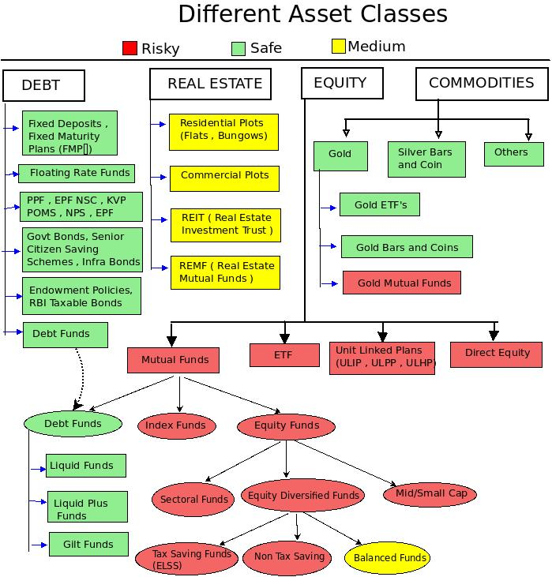

## Regulators

In India, the stock market regulator is called **The Securities and Exchange Board of India**, often referred to as SEBI.
In general, SEBI ensures:

The stock exchanges *(BSE and NSE)* conducts its business fairly
Stockbrokers and sub-brokers conduct their business fairly
Participants don’t get involved in unfair practices
Corporate’s don’t use the markets to unduly benefit themselves (Example – Satyam Computers)
Small retail investors interests are protected
Large investors with huge cash pile should not manipulate the markets
Overall development of markets

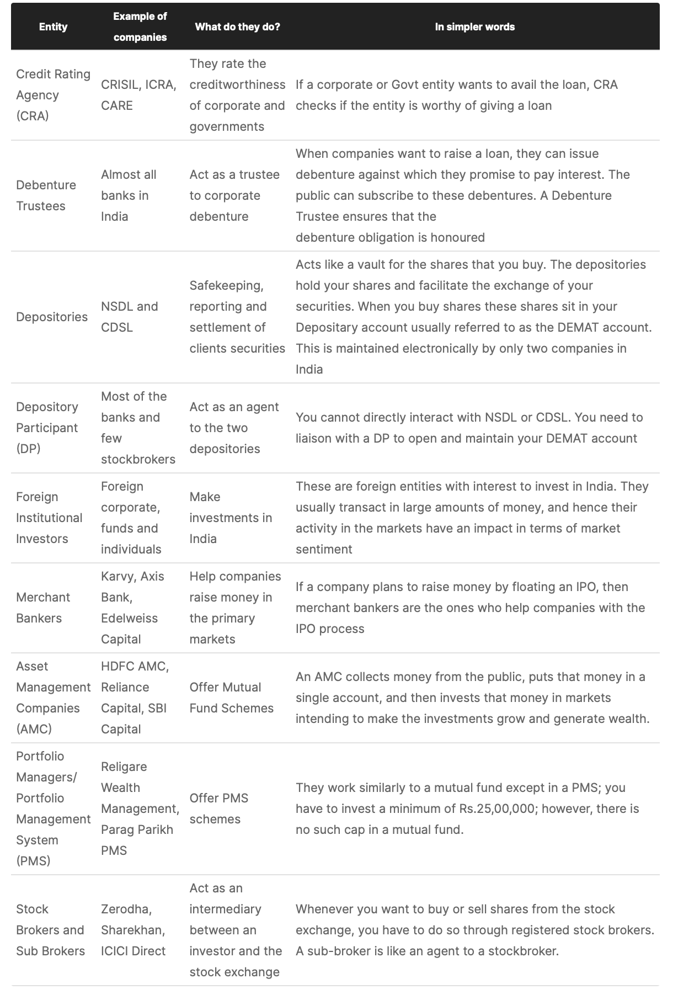

## Financial Intermediaries

### 1. Stock broker 
A stockbroker is a corporate entity, registered as a trading member with the stock exchange and holds a stockbroking license. A stockbroker is your gateway to stock exchanges. First, you need to open something called a **‘Trading Account’** with a broker who meets your requirements.  
A trading account lets you carry financial transactions in the market. A trading account is an account with the broker, which lets the investor buy/sell securities.

The basic services provided by the brokers include…

1. Give you access to markets and letting you transact
1. Give you margins for trading – We will discuss this point at a later stage.
1. Provide support – Dealing support if you have to call and trade. Software support if you have issues with the trading terminal
1. Issue contract notes for the transactions – A contract note is a written confirmation detailing the transactions you have carried out during the day.
1. Facilitate the fund transfer between your trading and bank account
1. Provide you with a back-office login – using which you can see the summary of your account
1. The broker charges a fee for the services he provides called the ‘brokerage charge’ or just brokerage. The brokerage rates vary, and it’s upto you to find a broker who strikes a balance between the fee he collects versus the services he provides.

### 2. Depository and Depository Participants

Before 1996 the share certificate was in paper format; however post 1996, the share certificates were converted to digital form. Converting a paper format share certificate into a digital format share certificate is called “Dematerialization” often abbreviated as DEMAT. The share certificate in DEMAT format has to be stored digitally. The storage place for the digital share certificate is the **‘DEMAT Account’**.  
A Depository is a financial intermediary which offers the service of the Demat account. A DEMAT account in your name will have all the shares in the electronic format you bought. Think of the DEMAT account as a digital vault for your shares.  
your broker’s trading account and the DEMAT account from the Depository are interlinked.  

At present, only two depositaries are offering you DEMAT account services. They are The National Securities Depository Limited (NSDL) and Central Depository Services (India) Limited. There is virtually no difference between the two, and both of them operate under strict SEBI regulations.

Just like the way you cannot walk into National Stock Exchange’s office to open a trading account, you cannot walk into a Depository to open a DEMAT account. To open a DEMAT account, you need to liaison with a Depository Participant (DP). A DP helps you set up your DEMAT account with a Depository. A DP acts as an agent to the Depository. Needless to say, even the DP is governed by the regulations laid out by the SEBI.

### 3. Banks

Banks help in facilitating the fund transfer from your bank account to your trading account. You cannot transfer money from a bank account that is not in your name.  
You can link multiple bank accounts to your trading through which you can transfer funds and trade. At Zerodha, you can add 1 primary bank account and up to 2 secondary bank accounts. You can use all the bank accounts to add funds, but withdrawals are only processed to the primary bank account. Also, dividend payments, money from buybacks will be sent to the primary bank account.

The three financial intermediaries operate via three different accounts – ***trading account, DEMAT account and Bank account***. All three accounts operate electronically and are interlinked, giving you a very seamless experience.

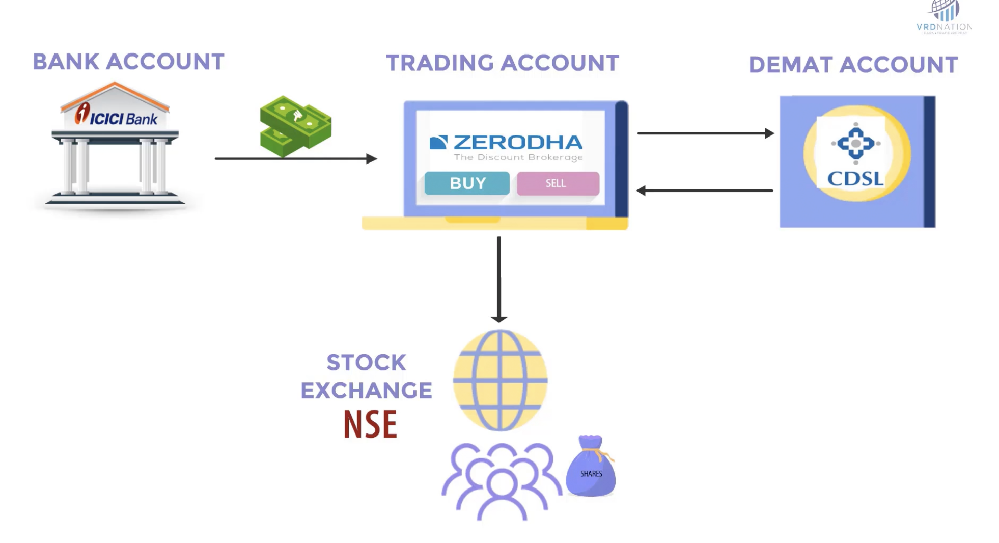

### 4. NSCCL and ICCL

NSCCL – National Security Clearing Corporation Ltd and Indian Clearing Corporation are wholly owned subsidiaries of National Stock Exchange and Bombay Stock Exchange.
The job of the clearing corporation is to ensure guaranteed settlement of your trades/transactions.  
For all practical purposes, it’s ok not to know much about NSCCL or ICCL simply because, you as a trader or investor would not be interacting with these agencies directly. You need to be aware that certain professional institutions are heavily regulated and work towards a smooth settlement and efficient clearing activity.

## The IPO Markets 

### Origin of a Business

#### Angel Investors. 
They believe in **Promotors** (Founders of the company) and invest money. So let us imagine that the promoter, along with the angels, raises INR 5 Crore in the capital. This initial money that he gets to kick start his business is called **‘The Seed Fund’**. It is important to note that the seed fund will not sit in the entrepreneur’s (also called the promoter) personal bank account but instead sits in its bank account. Once the seed capital hits the company’s bank account, the money will be referred to as the company’s initial share capital.

In return for the initial seed investment, the original three (promoter plus 2 angels) will be issued share certificates of the company which entitles them to the company.

The only asset that the company has at this stage is the cash of INR 5 Crs, the company’s value is also INR 5 Crs. This is called the company’s **valuation**.  
Issuing shares is quite simple; the company assumes that each share is worth Rs.10 and because there is Rs.5 crore as share capital, there have to be 50 lakh shares with each share worth Rs.10. In this context, Rs.10 is called the ‘Face value’ (FV) of the share. The face value could be any number. If the FV is Rs.5, then the number of shares would be 1 crore, so on and so forth.

A total of 50 lakh shares is called the **Authorized shares** of the company. These shares have to be allotted amongst the promoter, and two angels plus the company has to retain some amount of shares with itself to be issued in the future.

So let us assume the promoter retains 40% of the shares, and the two angels get 5% each, and the company retains 50% of the shares. Since the promoter and two angels own 50% of the shares, this allotted portion is called **Issued shares**.

The shareholding pattern of this company would look something like this:

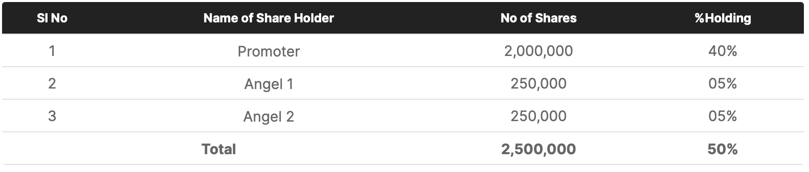 
Please note the company retains the balance of 50% of the shares totalling 2,500,000 equity shares. These shares are authorized but not allotted.

#### The Venture Capitalist

When business starts generating revenue and the promotor wants more money to expand business then VC's can be approached for investments.  Let us assume he meets one such professional investor who agrees to give him 7 Crs for a 14% stake in his company.

The investor who typically invests in such an early stage of business is called a **Venture Capitalist (VC)**, and the money that the business gets at this stage is called **Series A funding.**

After the company agrees to allot 14% to the VC from the authorized capital, the shareholding pattern looks like this:

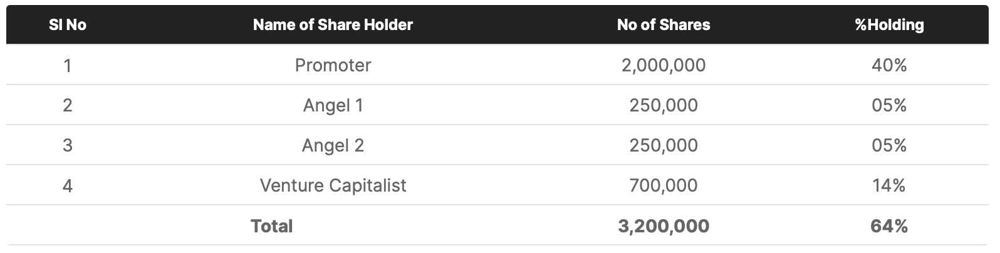

Note, the balance 36% of shares is still retained within the company and has not been issued.

With the VC’s money coming into the business, an exciting development has taken place. **The VC values the entire business at INR 50 Crs by valuing his 14% stake in the company at INR 7Crs.** 

With the valuations going up, the investments made by the initial investors will have an impact. The following table summarizes the same…

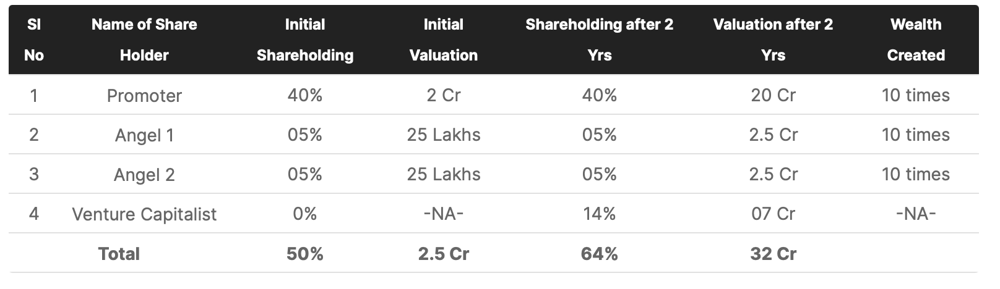

Going forward with our story, the promoter now has the additional capital he requires for the business. The company gets an additional manufacturing unit and a few more retail outlets in the city as planned. Things are going great; the popularity of the product grows, translating into higher revenues. The management team gets more professional, thereby increasing the operational efficiency, which translates to better profits.

#### The Banker

The company decides to have a retail presence in at least 3 more cities. To back the retail presence across three cities, the company also plans to increase the production capacity and hire more resources. Whenever a company plans such expenditure to improve the overall business, the expenditure is called **‘Capital Expenditure’ or simply ‘CAPEX’**.

The management estimates 40Crs towards their CAPEX requirements. How does the company get this money or in other words, how can the company fund its CAPEX requirements?

There are few options with the company to raise the required funds for their CAPEX:

* The company has made some profits over the last few years; a part of the CAPEX requirement can be funded through the profits. This is also called funding through **internal accruals**.
* The company can approach another VC and raise another round of VC funding by allotting shares from the authorized capital – this is called **Series B funding.**
* The company can approach a bank and seek a loan. The bank would be happy to tender this loan as the company has been doing fairly well. The loan is also called **‘Debt.’**  

The company decides to exercise all three options at its disposal to raise funds for Capex. It ploughs 15Crs from internal accruals, plans a series B – divests 5% equity for a consideration of 10Crs from another VC and raises 15Crs debt from the banker.

**Note, with 10Crs coming in for 5%, the company’s valuation now stands at 200 Crs.**

The shareholding and valuation look something like this:

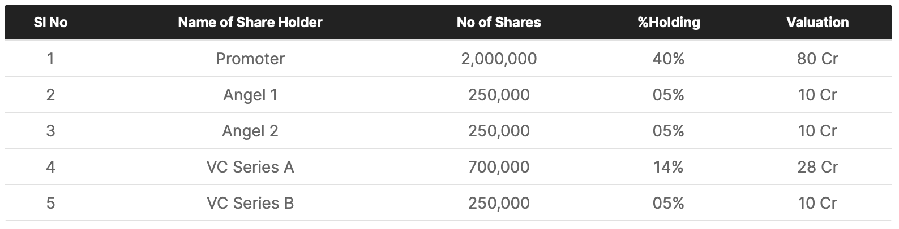

Note, the company still has 31% of shares not allotted to shareholders now being valued at 62 Crs.  

#### The Private Equity

The company decides to raise the bar and branch out across the country. The CAPEX requirement for the new ambition is now pegged at 60 Crs. The company does not want to raise money through debt because of the interest rate burden, also called the **finance charges**, which would eat away the company’s profits.

They decide to allot shares from the authorized capital for a Series C funding. They cannot approach a typical VC because VC funding is usually small and runs into a few crores. This is when a **Private Equity (PE) investor** comes into the picture.

PE investors are quite savvy. They are highly qualified and have an excellent professional background. They invest large amounts of money to provide the capital for constructive use and place their own people on the board of the investee company to ensure the company steers in the required direction.

Assuming they pick up a 15% stake for a consideration of 60Crs, they are now valuing **the company at 400Crs**.  
Let’s have a quick look at the shareholding and valuations:

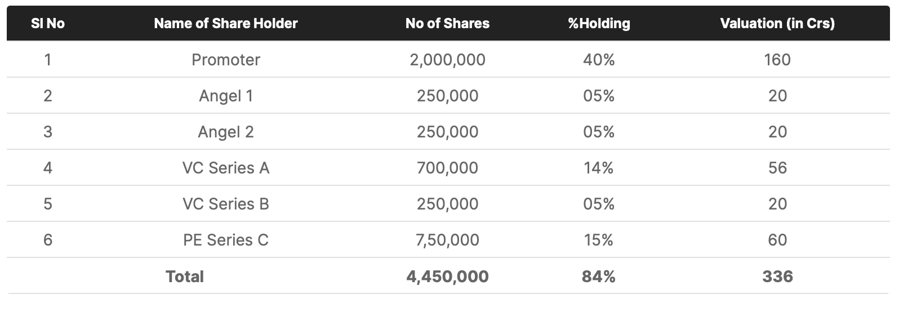

Please note, the company has retained a 16% stake which has not been allotted to any shareholder. This portion is valued at 64 Crs.

Usually, when a PE invests, they invest intending to fund large CAPEX requirements. Besides, they do not invest in the early stage of a business; instead, they prefer to invest in companies that already have a revenue stream, and are in operation for a few years. Deploying the PE capital and utilizing the capital for the CAPEX requirements takes up a few years.

### The IPO

Company has successfully diversified their product portfolio and have a presence across all the major cities in the country.  
The promoter now aspires to go international! He wants his brand to be available across all the major international cities.  
This time around the CAPEX requirement is huge, and the management estimates this at 200 Crs.   

The company has few options to fund the CAPEX requirement.

1. Fund Capex from internal accruals
1. Raise Series D from another PE fund
1. Raise debt from bankers
1. Float a bond (this is another form of raising debt)
1. File for an Initial Public Offer (IPO) by allotting shares from authorized capital
1. A combination of all the above

For convenience, let us assume the company decides to fund the CAPEX partly through internal accruals and files for an IPO. When a company files for an IPO, they have to offer their shares to the general public. The general public will subscribe to the shares (i.e. if they want to) by paying a certain price. Now, because the company is offering the shares for the first time to the public, it is called the **“Initial Public Offer".**

#### Why do companies go public?

When a company decides to file for an IPO, invariably the main reason is to raise funds to fuel their CAPEX requirement.   
The promoter has 3 advantages by taking his company public:

1. He is raising funds to meet CAPEX requirement
1. He is avoiding the need to raise debt which means he does not have to pay finance charges which translates to better profitability
1. Whenever you buy a share of a company, you are in essence taking the same amount of risk as the promoter is taking. 

There are other advantages as well in going for an IPO…

* Provide an exit for early investors 
* Reward employees 
* Improve visibility - Going public definitely increases visibility as the company has a status of being publicly held and traded. There is a greater chance of people’s interest in the company, consequently creating a positive impact on its growth.

Now the company requires 200 Crs to fund their CAPEX and the management had decided to fund this partly by internal accrual and partly by filing for an IPO.

Do recollect that the company still has 16% of authorized capital translating to 800,000 shares which are not allotted. The last valuation of these shares when the PE firm invested in Series B was 64Crs. The company has progressed really well ever since the PE firm has invested and naturally the valuation of these shares would have gone up.

For the sake of simplicity, let us assume the company is now valuing the 16% shares anywhere between 125 Crs to 150 Crs. This translates to a per-share value, anywhere between Rs.1562 to Rs.1875/-…(125Crs/8lakh).
So if the company puts 16% on the block to the public, they are likely to raise anywhere between 125 to 150 Crs. The remainder has to come from internal accruals. So naturally, the more money they raise, the better it is for the company.

#### Merchant Bankers

Having decided to go public, the company must now do a series of things to ensure a successful initial public offering. The first and foremost step would be to appoint a merchant banker. Merchant bankers are also called Book Running Lead Managers (BRLM)/Lead Manager (LM). The job of a merchant banker is to assist the company with various aspects of the IPO process including:

* **Underwrite shares** – By underwriting shares, merchant bankers essentially agree to buy all or part of the IPO shares and resell the same to the public
* Should work closely with the company and prepare their listing documents including **Draft Red Herring Prospectus (DRHP)**
* Help the company arrive at the **price band for the IPO**. A price band is the lower and upper limit of the share price within which the company will go public. In the case of our example, the price band will be Rs.1562/- and Rs.1875/-
* Help the company with the roadshows – This is like a promotional/marketing activity for the company’s IPO
* Appointment of other intermediaries namely, registrars, bankers, advertising agencies, etc. The Lead manager also makes various marketing strategies for the issue.  

Once the company partners with the merchant banker, they will work towards taking the company public.

#### IPO sequence of events

Needless to say, each and every step involved in the IPO sequence has to happen under the SEBI guidelines

* **Appoint a merchant banker**. In case of a large public issue, the company can appoint more than 1 merchant banker
* **Apply to SEBI with a registration statement** – The registration statement contains details on what the company does, why the company plans to go public and the financial health of the company
* **Getting a nod from SEBI** – Once SEBI receives the registration statement, SEBI takes a call on whether to issue a go-ahead or a ‘no go’ to the IPO
* **DRHP** – If the company gets the initial SEBI nod, then the company needs to prepare the DRHP. A DRHP is a document that gets circulated to the public. Along with a lot of information, DRHP should contain the following details:

		1. The estimated size of the IPO
		2. The estimated number of shares being offered to the public
		3. Why the company wants to go public and how does the company plan to utilize the funds along with the timeline projection of fund utilization
		4. Business description including the revenue model, expenditure details
		5. Complete financial statements
		6. Management Discussion and Analysis – how the company perceives future business operations to emerge
		7. Risks involved in the business
		8. Management details and their background

* **Market the IPO** – This would involve TV and print advertisements in order to build awareness about the company and its IPO offering. This process is also called the IPO roadshow
* **Fix the price band** – Decide the price band between which the company would like to go public. Of course, this can’t be way off the general perception. If it is, then the public will not subscribe for the IPO
* **Book Building** – Once the roadshow is done and the price band fixed the company now has to officially open the window during which the public can subscribe for shares. For example, if the price band is between Rs.100 and Rs.120, then the public can actually choose a price they think is fair enough for the IPO issue. The process of collecting all these price points along with the respective quantities is called Book Building. Book building is perceived as an effective price discovery method
* **Closure** – After the book building window is closed (generally open for few days) then the price point at which the issue gets listed is decided. This price point is usually the price at which maximum bids have been received.
* **Listing Day** – This is the day when the company actually gets listed on the stock exchange. The listing price is the price decided based on market demand and supply on that day and the stock is listed at a premium, par or discount of the cut-off price

#### What happens after the IPO?

During the bidding process (also called the date of issue) investors can bid for shares at a particular price within the specified price band.  This whole system around the date of the issue where one bids for shares, is referred to as the Primary Market. The moment the stock gets listed and debuts on the stock exchange, the stock starts to trade publicly. This is called the secondary market.

Once the stock transitions from primary markets to secondary markets, the stock gets traded daily on the stock exchange. People start buying and selling stocks regularly.

#### Few key IPO jargons

* **Under subscription** – Let’s say the company wants to offer 100,000 shares to the public. During the book-building process, it is discovered that only 90,000 bids were received, then the issue is said to be under subscribed. This is not a great situation to be in as it indicates negative public sentiment

* **Oversubscription** – If there are 200,000 bids for 100,000 shares on offer then the issue is said to be oversubscribed 2 times (2x)

* **Green Shoe Option** – Part of the underwriting agreement which allows the issuer to authorize additional shares (typically 15 percent) to be distributed in the event of oversubscription. This is also called the overallotment option

* **Fixed Price IPO** – Sometimes the companies fix the price of the IPO and do not opt for a price band. Such issues are called fixed price IPO

* **Price Band and Cut off price** – Price band is a price range between which the stock gets listed. For example, if the price band is between Rs.100 and Rs.130, then the issue can list within the range. Let’s says it gets listed at 125, then 125 is called the cut off price.

## Stock Market - Basics

**Authorized shares** - Refer to the largest number of shares that a single corporation can issue. The number of authorized shares per company is assessed at the company's creation and can only be increased or decreased through a vote by the shareholders

**Treasury** - Shares hold by company itself

**Restricted Shares** - refer to a company's issued stock that cannot be bought or sold without special permission. Restricted stock refers to unregistered shares of ownership in a corporation that are issued to corporate affiliates, such as executives and directors. Restricted stock is non-transferable and must be traded in compliance with special Securities and Exchange Commission (SEC) regulations.

**Float Shares** -  refers to a company's shares that are freely bought and sold without any restrictions by the public

**Outstanding Shares = Restricted  shares + float shares**

Let's assume company XYZ. the company has 1,000 authorized shares. If it offered 300 shares in an IPO, gave 150 to the executives, and retained 550 in the treasury, then the number of shares outstanding would be 450 shares (300 float shares + 150 restricted shares). If after a couple of years XYZ was doing extremely well and wanted to buy back 100 shares from the market, the number of outstanding shares would fall to 350, the number of treasury shares would increase to 650 and the float would fall to 200 shares since the buyback was done through the market (300 – 100).

### How to calculate returns?

Returns are usually expressed in terms of annual yield. There are different kinds of returns that you need to be aware of.

**Absolute Return** – This is return that your trade or investment has generated in absolute terms. It helps you answer this question – I bought Infosys at 3030 and sold it 3550. How much percentage return did I generate?

The formula to calculate the same is [(Ending Period Value / Starting Period Value) – 1]*100

i.e [(3550/3030) -1] * 100

= [1.1716 -1] * 100

= 0.1716 * 100

= 17.16%

A 17.6% is not a bad return at all!

**Compounded Annual Growth Rate (CAGR)** – An absolute return can be misleading if you want to compare two investments. CAGR helps you answer this question – I bought Infosys at 3030 and held the stock for 2 years and sold it 3550. At what rate did my investment grow over the last two years?

CAGR factors in the time component which we had ignored when we computed the absolute return.

The formula to calculate CAGR is ..

CAGR = [ { (Ending value / Beginning Value) ^ (1/N) } -1 ] * 100

i.e [ { (3550/3030)^(1/2) } -1 ] * 100

= [ { (1.1716)^(1/2) } -1 ] * 100

= [ 1.082 -1 ] * 100

= 0.82 * 100

= 8.2%

Always use **CAGR** when you want to check returns over multiple years. Use **absolute return** when your time frame is for a year or lesser.

What if you have bought Infosys at 3030 and sold it at 3550 within 6 months? In that case you have generated 17.16% in 6 months which translates to 34.32% (17.16% * 2) for the year.

So the point is, if you have to compare returns, its best done when the return is expressed on an annualized basis.

### Types of Traders

1. **Day Trader** – A day trader initiates and closes the position during the day. He does not carry forward his positions. He is risk averse and does not like taking overnight risk. For example – He would buy 100 shares of TCS at 2212 at 9:15AM and sell it at 2220 at 3:20 PM making a profit of Rs.800/- in this trade. A day trader usually trades 5 to 6 stocks per day.
1. **Scalper** – A type of a day trader. He usually trades very large quantities of shares and holds the stock for very less time with an intention to make a small but quick profit. For example – He would buy 10,000 shares of TCS as 2212 at 9:15 and sell it 2212.1 at 9.16. He ends up making 1000/- profit in this trade. In a typical day, he would have placed many such trades. As you may have noticed a scalp trader is highly risk averse.
1. **Swing Trader** – A swing trader holds on to his trade for slightly longer time duration, the duration can run into anywhere between few days to weeks. He is typically more open to taking risks. For example – He would buy 100 shares of TCS at 2212 on 12th June 2014 and sell it 2214 on 19th June 2014.

### Types of Investors

An investor is a person who buys a stock expecting a significant appreciation in the stock. He is willing to wait for his investment to evolve. The typical holding period of investors usually runs into a few years. There are two popular types of investors..

1. **Growth Investors** – The objective here is to identify companies which are expected to grow significantly because of emerging industry and macro trends. A classic example in the Indian context would be buying Hindustan Unilever, Infosys, Gillette India back in 1990s. These companies witnessed huge growth because of the change in the industry landscape thereby creating massive wealth for its shareholders.
1. **Value Investors** – The objective here is to identify good companies irrespective of whether they are in growth phase or mature phase but beaten down significantly due to the short term market sentiment thereby making a great value buy. An example of this in recent times is L&T. Due to short term negative sentiment; L&T was beaten down significantly around August/September of 2013. The stock price collapsed to 690 all the way from 1200. At 690 (given its fundamentals around Aug 2013), a company like L&T is perceived as cheap, and therefore a great value pick. Eventually it did pay off, as the stock price scaled back to 1440 around May 2014.

### The Index

If I were to ask you how the stock market is moving today, how would you answer my question? There are approximately 5,000 listed companies in the Bombay Stock Exchange and about 2,000 listed companies on the National Stock Exchange. It would be clumsy to check every company, figure out if they are up or down for the day and then give a detailed answer.

Luckily you need not actually track these selected companies individually to get a sense of how the markets are doing. The important companies are pre-packaged and continuously monitored to give you this information. This pre-packaged market information tool is called the **‘Market Index’.**

There are two main market indices in India. The **S&P BSE Sensex** representing the Bombay stock exchange and **CNX Nifty** representing the National Stock exchange.

**S&P stands for Standard and Poor’s**, a global credit rating agency. S&P has the technical expertise in constructing the index which they have licensed to the BSE. Hence the index also carries the S&P tag.

CNX Nifty consists of the largest and most frequently traded stocks within the National Stock Exchange. It is maintained by India Index Services & Products Limited (IISL), a joint venture of the National Stock Exchange and CRISIL. In fact, the term **‘CNX’** stands for CRISIL and NSE.

An ideal index gives us minute by minute reading about how the market participants perceive the future. The movements in the Index reflect the changing expectations of the market participants. When the index goes up, it is because the market participants think the future will be better. The index drops if the market participants perceive the future pessimistically

National Stock Exchange Fifty (NIFTY) consitutes of ***50 companies*** from different sectors  
Senstive Index (SENSEX) consitutes of ***30 companies*** from different sectors

The major sectors are IT tech, Energy, Banks, Automobile, Pharma

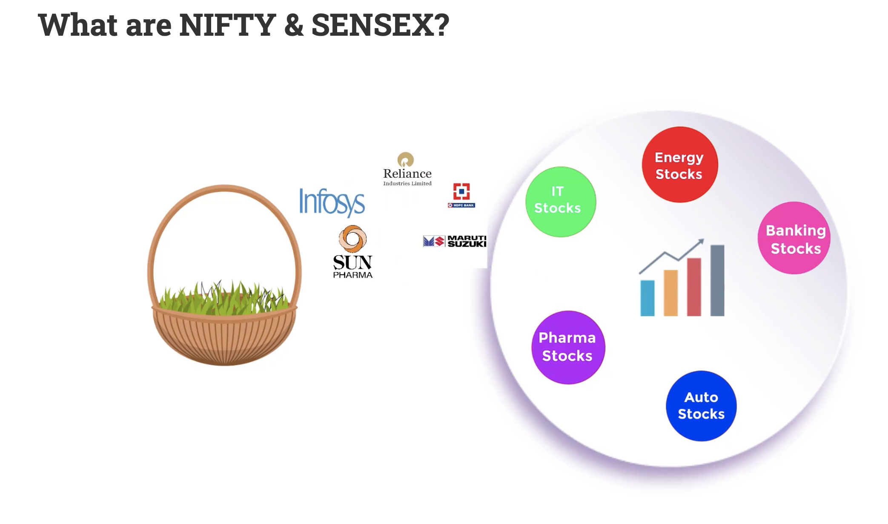

### Practical uses of the Index

* **Information** – The index reflects the general market trend for a period of time. The index is a broad representation of the country’s state of the economy. A stock market index that up indicates people are optimistic about the future. Likewise, when the stock market index is down, people are pessimistic about the future.

* **Benchmarking** – For all the trading or investing activity that one does, a yardstick to measure the performance is required.  Assume over the last 1 year you invested Rs.100,000/- and generated Rs.20,000 return to make your total corpus Rs.120,000/-. How do you think you performed? Well on the face of it, a 20% return looks great. However, what if Nifty moved to 7,800 points from 6,000 points generating a return on 30% during the same year?

	Well, suddenly it may seem to you that you have underperformed the market! If not for the Index, you can’t really figure out how you performed in the stock market. You need the index to benchmark the performance of a trader or investor. Usually, the objective of market participants is to outperform the Index.

* **Trading** – Trading on the index is probably one of the most popular uses of the index. Majority of the traders in the market trade the index. They take a broader call on the economy or general state of affairs and translate that into a trade.

	For example, imagine this situation. At 10:30 AM, the Finance Minister is expected to deliver his budget speech. An hour before the announcement Nifty index is at 6,600 points. You expect the budget to be favourable to the nation’s economy. What do you think will happen to the index? Naturally, the index will move up. So to trade your point of view, you may want to buy the index at 6,600. After all, the index is the representation of the broader economy.

	So as per your expectation, the budget is good, and the index moves to 6,900. You can now book your profits, and exit the trade at a 300 points profit!  Trades such as these are possible through what is known as the ‘Derivative’ segment of the markets.

* **Portfolio Hedging** – Investors usually build a portfolio of securities. A typical portfolio contains 10 – 12 stocks which they would have bought from a long term perspective. While the stocks are held from a long term perspective, they could foresee a prolonged adverse movement in the market (2008), potentially eroding the capital in the portfolio. In such a situation, investors can use the index to hedge the portfolio.

### Index construction methodology

The Index is a composition of many stocks from different sectors that collectively represent the economy’s state. To include a stock in the index, it should qualify certain criteria. Once qualified as an index stock, it should continue to qualify on the stated criteria. If it fails to maintain the criteria, the stock gets replaced by another stock that qualifies the prerequisites.

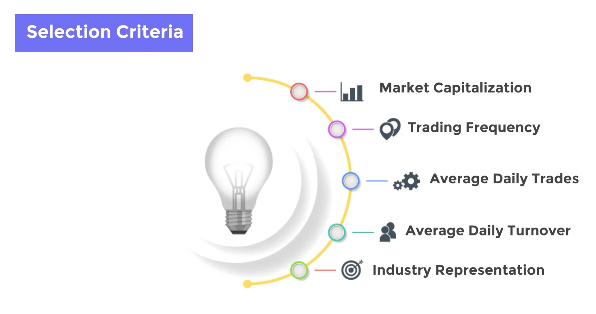

**Index Rebalancing -** Only the best peforming companies get to stay in Index. Twice a year some companies are kicked out of index and new companies which satisfy criteria are added in Index. This process of keeping only best and bright companies in Index is called Index rebalancing. For ex. In 2018 JSW steel added in NIFTY and Lupin was kicked out

Based on the selection procedure, the list of stocks is populated. Each stock in the index should be assigned a certain weightage. Weightage in simpler terms defines how much importance a certain stock in the index gets compared to the others

There are many ways to assign weights, but the Indian stock exchange follows a **free-float market capitalization** method. The weights are assigned based on the company’s free-float market capitalization, the larger the market capitalization, the higher is the weight.

**Free float market capitalization is the product of the total number of shares outstanding in the market and the stock price.**

**Free float market cap = outstsanding shares * stock price**

For example company, ABC has 100 shares outstanding in the market, and the stock price is at 50 then the free-float market cap of ABC is 100*50 = Rs.5,000.

The following are the 50 stocks in Nifty as per their weightage

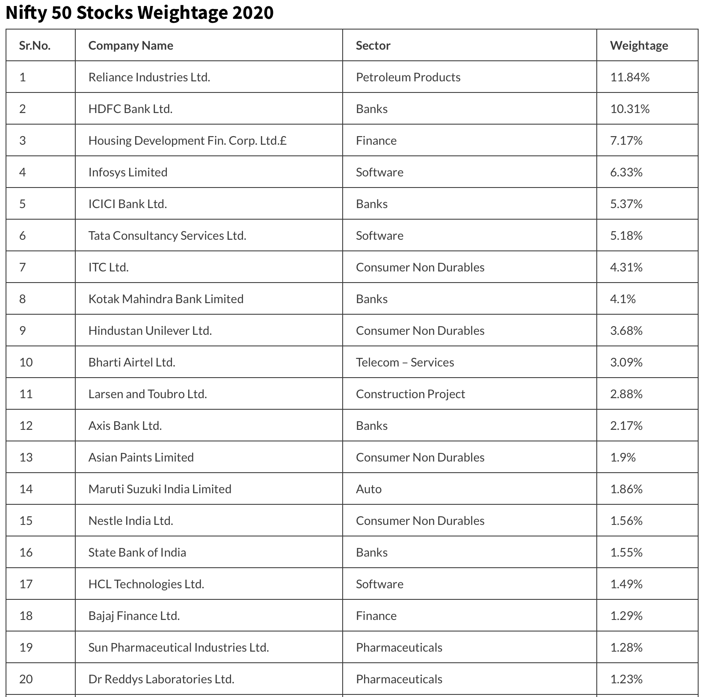

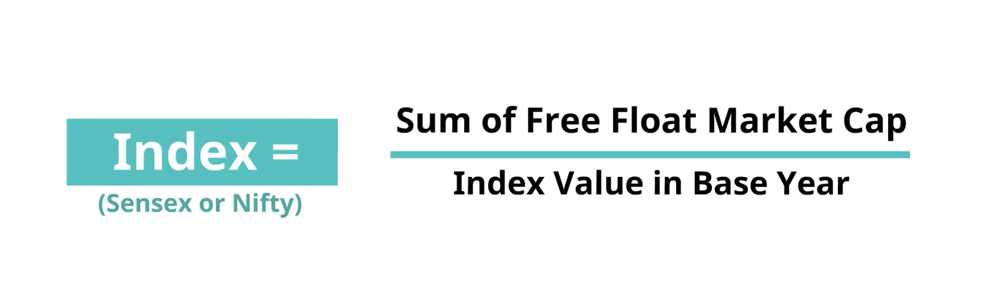

### Sector-specific indices

While the Sensex and Nifty represent the broader markets, certain indices represent specific sectors. These are called the sectoral indices. For example, the **Bank Nifty** on NSE represents the mood specific to the banking industry. The **CNX IT** on NSE represents the behaviour of all the IT stocks in the stock markets. Both BSE and NSE have sector-specific indexes.  The construction and maintenance of these indices are similar to the other major indices.

### Major indices around the world

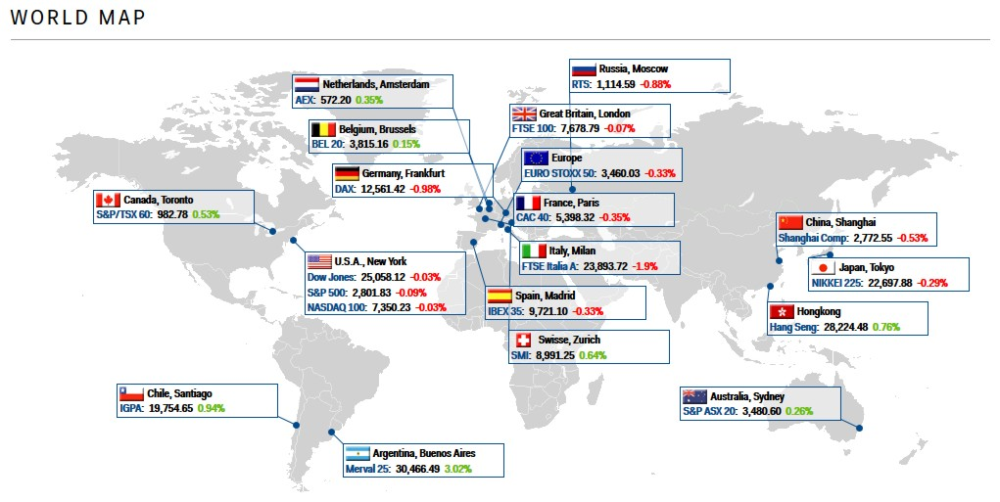

## Commonly Used Jargons

* **Bull Market (Bullish)** – If you believe that the stock prices are likely to go up,, you are bullish on the stock price. From a broader perspective, if the stock market index is going up during a particular time period, it is referred to as the bull market.
 
* **Bear Market (Bearish)** – If you believe that the stock prices are likely to go down,, you are bearish on the stock price. From a broader perspective, if the stock market index is going down during a particular time period, it is referred to as the bear market.

* **Trend** – The term ‘trend’ usually refers to the general market direction and its associated strength. For example, if the market is declining fast, the trend is said to be bearish. If the market is trading flat with no movement, then the trend is said to be sideways.

* **Face value of a stock** – Face value (FV) or par value of a stock indicates a share’s fixed denomination. The face value is important concerning a corporate action. Usually, when dividends and stock split are announced, they are issued keeping the face value in perspective. For example, the FV of Infosys is 5, and if they announce an annual dividend of Rs.63/- then it means the dividend paid is 1260%s (63 divided by 5).

* **52 week high/low** – 52 week high is the highest point at which a stock has traded during the last 52 weeks (which also marks a year) and likewise, 52 weeks low marks the lowest point at which the stock has traded during the last 52 weeks.

* **All-time high/low** – This is similar to the 52 weeks high and low, with the only difference being the all-time high price is the highest price the stock has ever traded from the time it has been listed. Similarly, the all-time low price is the lowest price at which the stock has ever traded from the time it has been listed.
 
* **Upper Circuit/Lower Circuit** – The exchange sets up a price band at which the stock can be traded in the market on a given trading day. The highest price the stock can reach on the day is the upper circuit limit, and the lowest price is the lower circuit limit. The limit for a stock is set to 2%, 5%, 10% or 20% based on the exchange’s selection criteria. The exchange places these restrictions to control excessive volatility when a stock reacts to certain news related to the company.
 
* **Long Position** – Long position or going long is simply a reference to the direction of your trade. For example, if you have bought or intend to buy Biocon shares,, you are long on Biocon or planning to go long on Biocon, respectively. If you have bought the Nifty Index with an expectation that the index will trade higher then essentially you have a long position on Nifty. If you are long on a stock or an index, you are said to be bullish.
 
* **Short Position** – Going short or simply ‘shorting’ is a term used to describe a transaction carried out in a particular order in a particular day. 
***SELL NOW BUY BACK***.   Shorting is only allowed in Intraday. 
 
 To summarize long and short positions…
 
	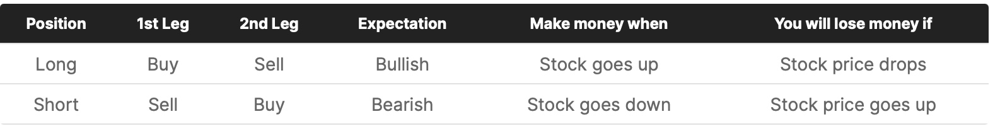

* **Square off** ­– Square off is a term used to indicate that you intend to close an existing position. If you are long on a stock squaring off the position means to sell the stock. When you are selling the stock to close an existing long position you are not shorting the stock!
  
  When you are short on the stock, squaring off a position means to repurchase the stock. Remember when you repurchase it, you are just closing an existing position, and you are not going long!

	|When you are| Square off position is|
	| :----------: | :-----------: |
	| Long      | Sell the stock      |
	| Short   | Buy the stock       |

* **Intraday position** – This is a trading position you initiate with an expectation to square off the position within the same day.

* **OHLC** ­– OHLC stands for open, high, low and close. For now, open is the price at which the stock opens for the day, high is the highest price at which the stock trade during the day, low is the lowest price at which the stock trades during the day and the close is the closing price of the stock.

* **Volume** –  Volumes represent the total transactions (both buy and sell put together) for a particular stock on a particular day.
 
* **Market Segment** – A market segment is a division within which a certain type of financial instrument is traded. Each financial instrument is characterized by its risk and reward parameters. The exchange operates in three main segments.

	1. Capital Market – Capital market segments offer a wide range of tradable securities such as equity, preference shares, warrants, and exchange-traded funds. Capital Market segment has sub-segments under which instruments are further classified. For example, common shares of companies are traded under the equity segment abbreviated as EQ. So if you were to buy or sell shares of a company you are essentially operating in the capital market segment.

	1. Futures and Options – Futures and Option, generally referred to as the equity derivative segment, would trade leveraged products. 

	1. Wholesale Debt Market – The wholesale debt market deals with fixed income securities. Debt instruments include government securities, treasury bills, bonds issued by a public sector undertaking, corporate bonds, corporate debentures, etc.

## Types of Orders

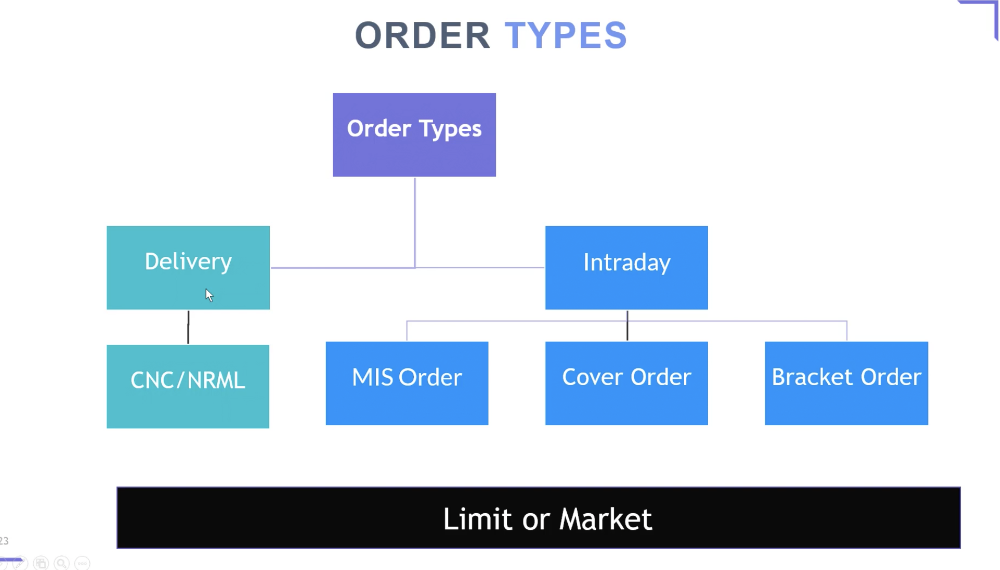

### Intraday Orders
### Simple Orders Types

#### 1. Limit order

A limit order is when you wish to purchase or sell a scrip at a certain price. When you place a limit order it will be executed only when the scrip reaches that price

#### 2. Market Order

A market order is when you wish to purchase or sell a scrip at the prevailing market rate. A market order will be executed at whatever market rate is prevalent at the time the order is placed.

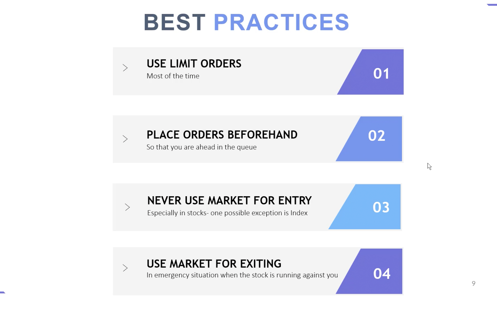

#### 3. Stop-Loss Order

An order placed to sell a scrip when it reaches a certain price is called a stop-loss order. The stop loss order is primarily meant to limit your loss on a scrip that you have already purchased. The price you mention in the stop-loss order is the highest risk that you are ready to take as loss on that scrip.
A stop-loss order is a passive order. To activate it, we need to enter a trigger price. A trigger price, usually above the stop-loss price acts as a price threshold and only after crossing this price the stop-loss order transitions from a passive order to an active order.

A stop-loss order can be a limit order or a market order.
	
**--> Stop Loss Market Order** - The stop loss market order is when once your stop loss is triggered and the order will be placed at whatever price is prevalent in the market. In this kind of stop loss order, only the trigger price is to be mentioned. Once the trigger price is hit, the order becomes a market order and is sent to the exchange.

**--> Stop-Loss Limit Order** - a stop-loss limit order will be executed at the price that you want the order to be executed at. The stop-loss is a mere trigger to validate the order. In this kind of stop loss order both the trigger and the limit price are to be given by the trader. In case of a (sell position) buy stop loss limit order the Trigger Price < Limit Price and in case of a (buy position) sell stop loss limit order the Trigger Price > Limit Price.  
eg. Buy position - Buy at 30, trigger at 27 & limit price at 26. so order will be placed at 26   
Sell position - Sell at 30, trigger at 32 & limit price at 35, so order to buy shares at 35 will be placed

### Complex Orders Types

#### 4. Cover Order

This is a special order type which has a market order and a stop loss market order attached to it. In this type of special order, the first leg is always a market order; once executed, the second leg (the stop loss market order) is placed. The stop loss order cannot be canceled. Both orders are interconnected. The order can be modified up to the Last Traded Price (LTP) in the case of a favorable market movement. High leverage is provided. Stop loss price can't be wider because will not allow, there is a range within which stoploss price has to entered. Leverage - Ability to take trade higher than your trading capital is provided by broker

This is a special order type that has two different legs: 1st Leg: Limit Order / Market Order, 2nd Leg: Stop loss limit Order.

#### 5. After Market Order (AMO)

AMO or After Market Order is for those people who are busy during market hours but wish to participate. You can plan your orders at leisure after researching about the markets before the market opens and place an order after the market closes.The AMO (After Market Order) timing for Cash, F&O, Currency segment is 6.30 pm to 12.00 am and 4.00 am to 9.00 am and for MCX segment is 4.00 am to 9.45 am. The AMO timings are various to different broker. 
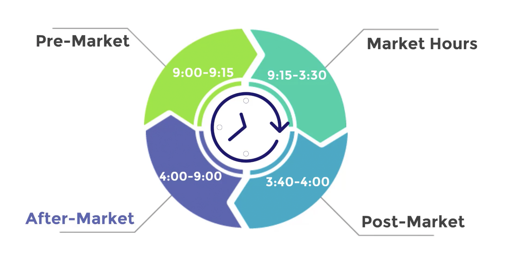

In AMO cannot place bracket, cover, sttoploss order. Placing AMO order on segments like cash, F&O, commodity also from broker to broker. 

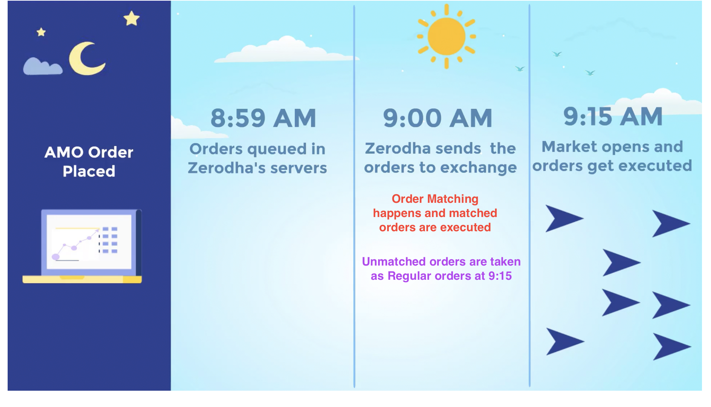
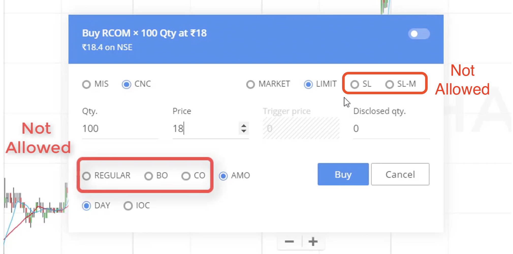

#### 6. Bracket Order

In this order type, 3 inputs to be given. Buy price, target price, stop loss price 
In this order type usually high leverage is provided by broker.  Leverage will vary based on the Stop loss price entered. It is usually trailing stop loss order. If u put stop loss of 3rs and if stock price goes up then stop loss position also goes up with that same difference of 3rs.  Stop loss price can't be wider because will not allow, there is a range within which stoploss price has to entered. For options bracket order is not allowed.
For each executed trade brokerage is charged

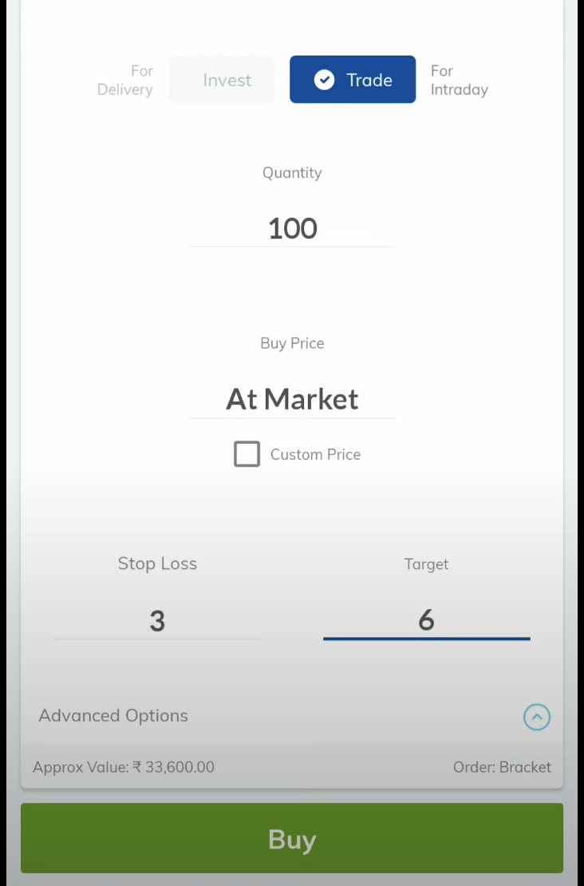 

### Delivery Order

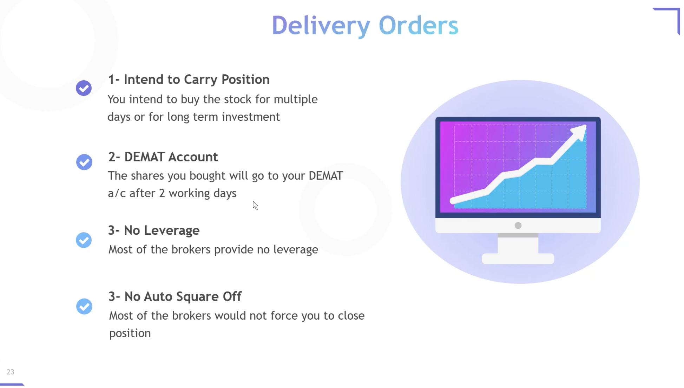

## Clearing and Settlement Process

### What happens when you buy a stock?

***Day 1 – The trade (T Day), Monday***

Assume on 23rd June 2014 (Monday) you buy 100 shares of Reliance Industries at Rs.1,000/- per share. The total buy value is Rs.100,000/- (100 * 1000). The day you make the transaction is referred to as the trade date, represented as ‘T Day’.

By the end of trade day, your broker will debit Rs.100,000/- and the applicable charges towards your purchase. Assuming the trade is executed through Zerodha, the applicable charges would be as follows:

So an amount of Rs.100,000/- plus Rs.103.93/- (which includes all the applicable charges) totalling Rs.100,103.93/- will be debited from your trading account the day you make the transaction. Remember, the money goes out of your account, but the stock has not come into your DEMAT account yet.

Also, on the same day, the broker generates a ‘contract note’ and sends you a copy. A contract note is like a bill generated detailing every transaction you made. This is an important document that is worth saving for future reference. A contract note typically shows a break up of all transactions done during the day along with the trade reference number. It also shows the breakup of charges charged by the broker.

***Day 2 – Trade Day + 1 (T+ day, Tuesday)***

The day after you made the transaction is called the T+1 day. On T+1 day, you can sell the stock that you purchased the previous day.  If you do so, you are basically making a quick trade called “Buy Today, Sell Tomorrow” (BTST) or “Acquire Today, Sell Tomorrow” (ATST). Remember the stock is not in your DEMAT account yet. Hence, there is a risk involved, and you could be in trouble for selling a stock that you don’t really own. This doesn’t mean, every time you make a BTST trade, you end up in trouble, but it does once in a way, especially when you trade B group and illiquid stocks. This happens a little convoluted, and we deliberately will not touch this topic now.

If you start fresh in the markets, I would suggest you do not make BTST trades unless you understand the risk involved.

From your perspective, nothing happens on T+1 day. However, in the background, the money required to purchase the shares is collected by the exchange and the exchange transaction charges and Security transaction tax.

***Day 3 – Trade Day + 2 (T+2 day, Wednesday)***

On day 3 or the T+2 day, around 11 AM shares are debited from the person who sold you the shares and credited to the brokerage with whom you are trading, who will in turn credit it to your DEMAT account by the end of the day. Similarly, money that was debited from you is credited to the person who sold the shares. 

The shares will now start reflecting in the DEMAT account indicating that you own 100 shares of Reliance.

So for all practical purposes, if you buy a share on day T Day, you can expect to receive the shares in your DEMAT account only by the end of T+2 day. The shares are available for a transaction on T+3day.

## Five Corporate Actions and Its Impact on Stock Prices

### Dividends

The company pays dividends to its shareholders. Dividends are paid to distribute the profits made by the company during the year. Dividends are paid on a per-share basis. For example, during the financial year, 2012-13 Infosys had declared a dividend of Rs.42 per share. The dividend paid is also expressed as a percentage of the face value. In the above case, the face value of Infosys was Rs.5/- and the dividend paid was Rs.42/- hence the dividend payout is said to be 840% (42/5).

It is not mandatory to pay out dividends every year. If the company feels that instead of paying dividends to shareholders, they are better off utilizing the same cash to fund a new project for a better future, they can do so.

The decision to pay a dividend is taken in the **Annual General Meeting (AGM)** during which the directors of the company meet. The dividends are not paid right after the announcement. This is because the shares are traded throughout the year, and it would be difficult to identify who gets the dividend and who doesn’t. The following timeline would help you understand the dividend cycle.

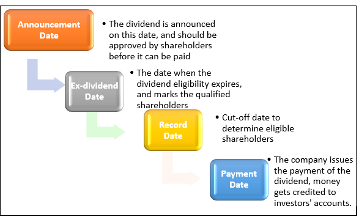

**Dividend Declaration Date:** This is the date on which the AGM takes place, and the company’s board approves the dividend issue

**Record Date:** This is when the company decides to review the shareholders register to list down all the eligible shareholders for the dividend. Usually, the time difference between the dividend declaration date and the record date is 30 days.

**Ex-Date/Ex-Dividend date:** The ex-dividend date is normally set two business days before the record date. Only shareholders who own the shares before the ex-dividend date are entitled to the dividend. This is because, in India, the normal settlement is on a T+2 basis. So for all practical purposes, if you want to be entitled to receive a dividend, you need to ensure you buy the shares before the ex-dividend date.

**Dividend Payout Date:** This is when the dividends are paid out to shareholders listed in the register of the company.

When the stock goes ex-dividend, usually the stock drops to the extent of dividends paid. For example, if ITC (trading at Rs. 335) has declared a dividend of Rs.5. On ex-date, the stock price will drop to the extent of dividend paid, and as in this case, the price of ITC will drop down to Rs.330. The reason for this price drop is because the amount paid out no longer belongs to the company.

Dividends can be paid anytime during the financial year. If it’s paid during the financial year, it is called the interim dividend. If the dividend is paid at the end of the financial year, it is called the final dividend.

### Bonus Issue

A bonus issue is a stock dividend, allotted by the company to reward the shareholders. The bonus shares are issued out of the reserves of the company. These are free shares that the shareholders receive against shares that they currently hold. These allotments typically come in a fixed ratio such as 1:1, 2:1, 3:1, etc.

If the ratio is 2:1 ratio, the existing shareholders get 2 additional shares for every 1 share they hold at no additional cost. So if a shareholder owns 100 shares, he will be issued an additional 200 shares, so his total holding will become 300 shares. When the bonus shares are issued, the number of shares the shareholder holds will increase, but an investment’s overall value will remain the same.

To illustrate this, let us assume a bonus issue on different ratios – 1:1, 3:1 and 5:1

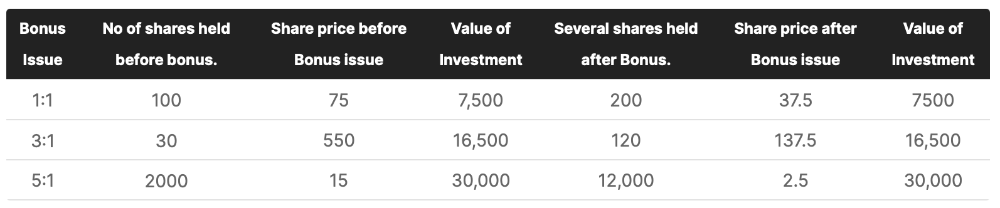

There is a bonus announcement date, ex-bonus date, and record date similar to the dividend issue.

Companies issue bonus shares to encourage retail participation, especially when the company’s price per share is very high, and it becomes tough for new investors to buy shares. By issuing bonus shares, the number of outstanding shares increases, but each share’s value reduces, as shown in the example above. The face value remains unchanged.

### Stock Split

When the company declares a stock split, the number of shares held increases, but the investment value/market capitalization remains similar to the bonus issue. The stock is split concerning the face value. Suppose the stock’s face value is Rs.10, and there is a 1:2 stock split then the face value will change to Rs.5. If you owned 1 share before the split, you would now own 2 shares after the split.

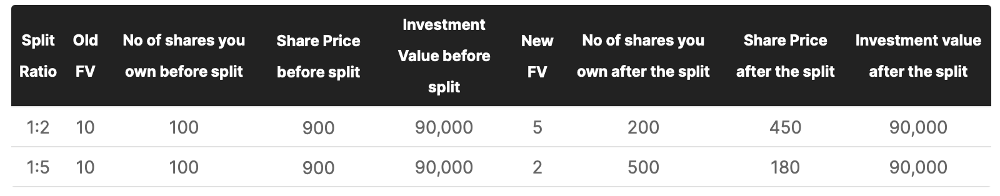

Like a bonus issue, a stock split is usually to encourage more retail participation by reducing the value per share.

### Rights Issue

The idea behind a rights issue is to raise fresh capital. However, instead of going public, the company approaches its existing shareholders Think about the rights issue as a second IPO and a select group of people (existing shareholders). The rights issue could be an indication of promising new development in the company. The shareholders can subscribe to the rights issue in the proportion of their shareholding. For example, 1:4 rights issue means every 4 shares a shareholder owns; he can subscribe to 1 additional share. Needless to say, the new shares under the rights issue will be issued at a lower price than what prevails in the markets.

However, a word of caution – The investor should not be swayed by the company’s discount, but they should look beyond that. A rights issue is different from a bonus issue as one is paying money to acquire shares. Hence the shareholder should subscribe only if he or she is completely convinced about the company’s future. If the market price is below the subscription price/right issue price, it is obviously cheaper to buy it from the open market.

### Buyback of shares

A buyback can be seen as a company’s method to invest in itself by buying shares from other investors in the market. Buybacks reduce the number of shares outstanding in the market; however, buyback of shares is an important corporate restructuring method. There could be many reasons why corporates choose to buy back shares…

Improve the profitability on a per-share basis
To consolidate their stake in the company.
To prevent other companies from taking over.
To show the confidence of the promoters about their company.
To support the share price from declining in the markets.
When a company announces a buyback, it signals the company’s confidence about itself. Hence this is usually positive for the share price.

## Key Events and Their Impact on Markets

### Monetary Policy

The monetary policy is a tool with which the Reserve Bank of India (RBI) controls the money supply by controlling the interest rates. They do this by tweaking the interest rates. RBI is India’s central bank. The world over every country’s central bank is responsible for setting interest rates.

While setting the interest rates, the RBI has to strike a balance between growth and inflation. In a nutshell – if the interest rates are high, that means the borrowing rates are high (particularly for corporations). If corporate can’t borrow easily, they cannot grow. If corporations don’t grow, the economy slows down.

On the other hand, when the interest rates are low, borrowing becomes easier. This translates to more money in the hands of corporations and consumers. With more money, there is increased spending which means the sellers tend to increase prices leading to inflation.

To strike a balance, the RBI has to consider all the factors and carefully set a few key rates. Any imbalance in these rates can lead to economic chaos. The key RBI rates that you need to track are as follows:

**Repo Rate –** Whenever banks want to borrow money, they can borrow from the RBI. The rate at which RBI lends money to other banks is called the repo rate. If the repo rate is high, that means the cost of borrowing is high, leading to slow growth in the economy. Currently, the repo rate in India is 8%. Markets don’t like the RBI increasing the repo rates.

**Reverse repo rate –** Reverse Repo rate is the rate at which RBI borrows money from banks. When banks lend money to RBI, they are certain that RBI will not default, and hence they are happier to lend their money to RBI as opposed to a corporate. However, when banks choose to lend money to the RBI instead of the corporate entity, the banking system’s supply of money reduces. An increase in reverse repo rate is not great for the economy as it tightens the supply of money. The reverse repo rate is currently at 7%.

**Cash reserve ratio (CRR) –** Every bank is mandatorily required to maintain funds with RBI. The amount that they maintain is dependent on the CRR. If CRR increases, then more money is removed from the system, which is not good for the economy.

The RBI meets every two months to review the rates. This is a key event that the market watches out for. The first to react to rate decisions would be interest-rate sensitive stocks across various sectors such as – banks, automobile, housing finance, real estate, metals, etc.

### Index of Industrial Production (IIP)

The Index of Industrial Production (IIP)  is a short-term indicator of how the country’s industrial sector is progressing. The data is released every month (along with inflation data) by the Ministry of Statistics and Programme Implementation (MOSPI). As the name suggests, the IIP measures the Indian industrial sectors’ production.  

Roughly about 15 different industries submit their production data to the ministry, which collates the data and releases it as an index number. If the IIP is increasing it indicates a vibrant industrial environment (as the production is going up) and hence a positive sign for the economy and markets. A decreasing IIP indicates a sluggish production environment, hence a negative sign for the economy and markets.

### Budget

A Budget is an event during which the Ministry of Finance discusses the country’s finance in detail. The Finance Minister, on behalf of the ministry, makes a budget presentation to the entire country. During the budget, major policy announcements and economic reforms are announced, which impacts various industries across the markets. Therefore the budget plays a vital role in the economy

To illustrate this further, one of the budget expectations (July 2014) was to increase the duties on a cigarette. As expected, during the budget, the Finance Minister raised the duties on a cigarette, and hence the prices of cigarettes were also increased. An increased cigarette price has a few implications:

Increased cigarette prices discourage smokers from buying cigarettes (needless to say this is debatable), and hence the profitability of the cigarette manufacturing companies such as ITC decreases. If the profitability decreases, then investors may want to sell shares of ITC.
If market participants start selling ITC, then the markets will come down because ITC is an index heavyweight.
As a reaction to the budget announcement, ITC traded 3.5% lower for this precise reason.

### Corporate Earnings Announcement

This is perhaps one of the important events to which the stocks react. The listed companies (trading on the stock exchange) must declare their earning numbers once in every quarter, also called the quarterly earnings numbers. During an earnings announcement, the corporate gives out details on various operational activities, including:

How much revenue has the company generated?
How has the company managed its expense?
How much money they did the company pay in terms of taxes and interest charges?
What is the profitability during the quarter?
Besides some companies give an overview of what they expect from the upcoming quarters. This forecast is called ‘corporate guidance’.

Invariably every quarter, the first blue-chip company to make the quarterly announcement is Infosys Limited. They also give out guidance regularly. Market participants keenly follow what Infosys has to say in terms of guidance as it has an overall impact on the markets.

The table below gives you an overview of the earning season in India:

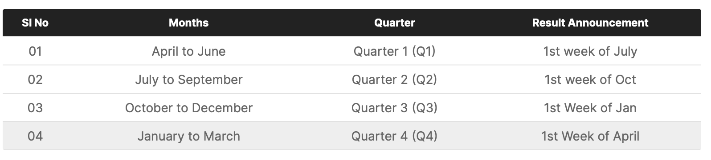

Every quarter when the company declares its earnings, the market participants match the earnings with their own expectation of how much the company should have earned. The market participant’s expectation is called the **‘street expectation’**.

The stock price will react positively if the company’s earnings are better than street expectation. On a similar logic, the stock price will react negatively if the actual numbers are below the street expectation.

## Nature of Market

**Market is supreme -** Do act according to market stats and dont counter act against it.  
**Market doesn't care about us -** Be prepared for everything. take careful decisions. Align yourself with the big players (Mutual funds, bank nifty) with large market cap to make profits.  
**Nobody can predict what the market will do tomorrow -** No one can speculate the market at any time.  
**Market changes all the time -** it changes, it wont be constant. Mix of Bull & Bear is the market. Adapt yourself.  
**Market never causes big losses -** We are responsible for our loss. Always we have option to exit. Listen to market.   
**We can understand only miniscule portion of market -** Do not overthink & dont try to learn all abt market. Learn only what is relevant to you and your segment of trade. Take trades only when you are confident about it

## Trading Commandments

**Never take big Losses -** In market only 3 scenarios -> small profit, big profit, small loss. Only in these 3 we must be aligned. Greed, fear of loss, inability to control emotions when we are in a trade... should overcome all this. 
 
**Never trade without preparation -** It would incur huge loss. always prepare before trading time. do some homework. Learn about stocks on different sectors and then prepare watchlist for trading. Without preparation then it is Gambling.  

**The Real Enemy is within you -** Emotions are hard to master. Losses are only because of you. No sentiments while trading.  

**Always keep learning -** No need to explain this. Just keep learning to survive. Explore new tech's.  

**BE humble -** Not to become over smart, when you are wrong accept it, learn from the mistake. Humble is good in life. But humble is required in market

## How to make money in Stock Market

### 2 ways

**Investing -** Becoming part owner of the ocmpany and benefit from its growth. Long term  
**Trading -** Take advantage of trends and patterns in the stock market. Short term

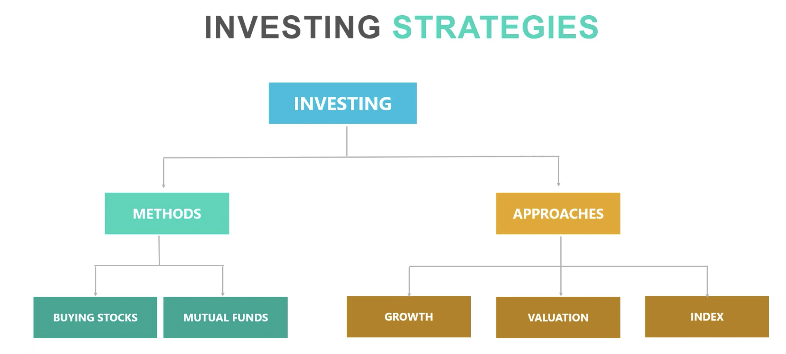

### Buying stocks

* Start early
* Buy on corrections
* Buy only quality stocks
* Diversify

Temparament - knowledge, courage, patience ... All these should possess by us for investing

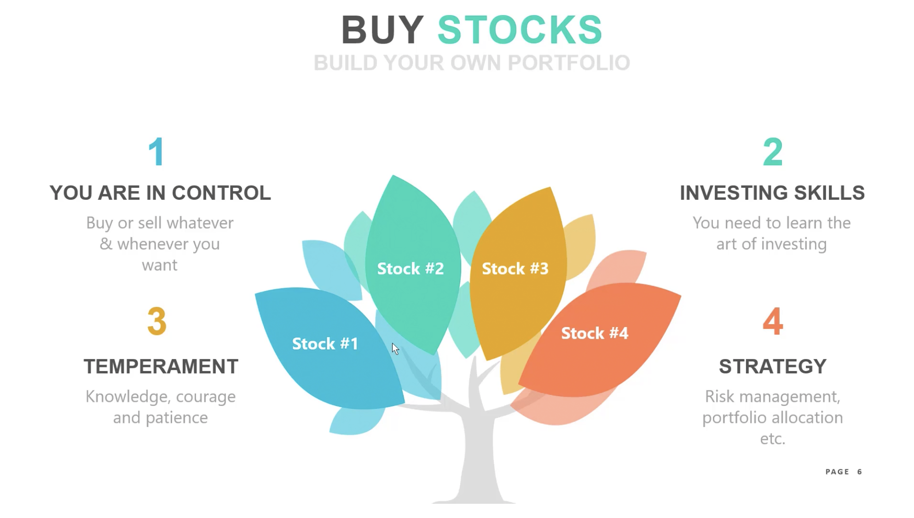

### Mutual Funds

Giving your funds to someone (Fund manager) to invest on behalf of you. Even though you know invest and can build your own portfolio but do invest in mutual funds to diversify portfolio.

Index funds - Best Investment option for Retial investors, Warren Buffet. In index funds, fund manager keep buying stocks of companies in index and sell stocks which goes out of index. i.e. Mirroring the Index

You --> Fund Manager --> Stock Market

**Types of Mutual funds**

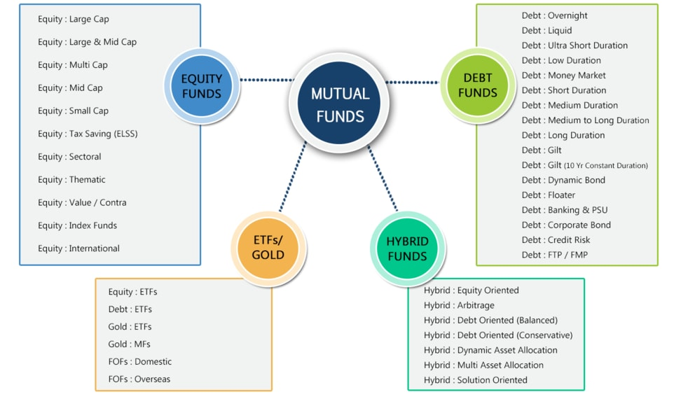

### Growth Investing

If you think a company will grow with high potential then you pick up the shares and hold for long term

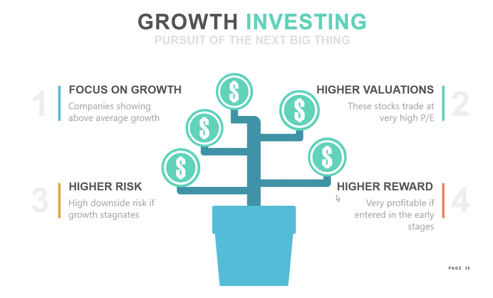

### Value Investing

Buy good company shares when the value comes down. only buy quality stocks. Buy on corrections. Take advantage of short term market negative sentiment. Do not buy in lumpsum. buy in accumulation

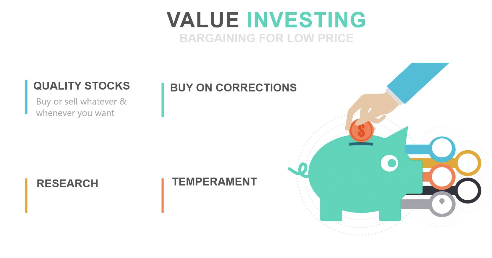

### Index Investing

Invest in Nifty, sensex, ETFs. Capital risk is less. 

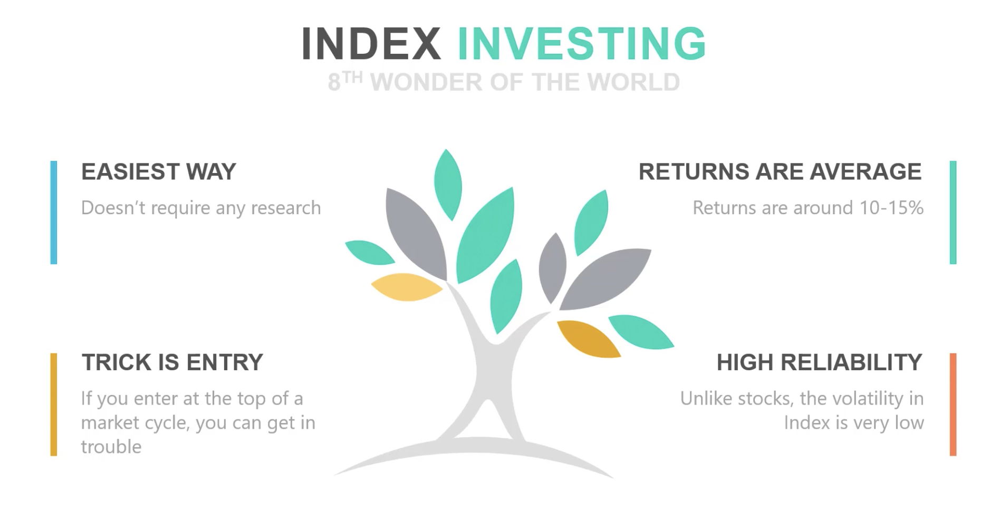

### Types of TRADING

#### Positional Trading

This is longest form of trading. Holding period is several weeks or several months. Level of effort required is low. Popular among working professionals. Positional trading cannot be done on small caps, mid caps. Only should do in Big stocks.

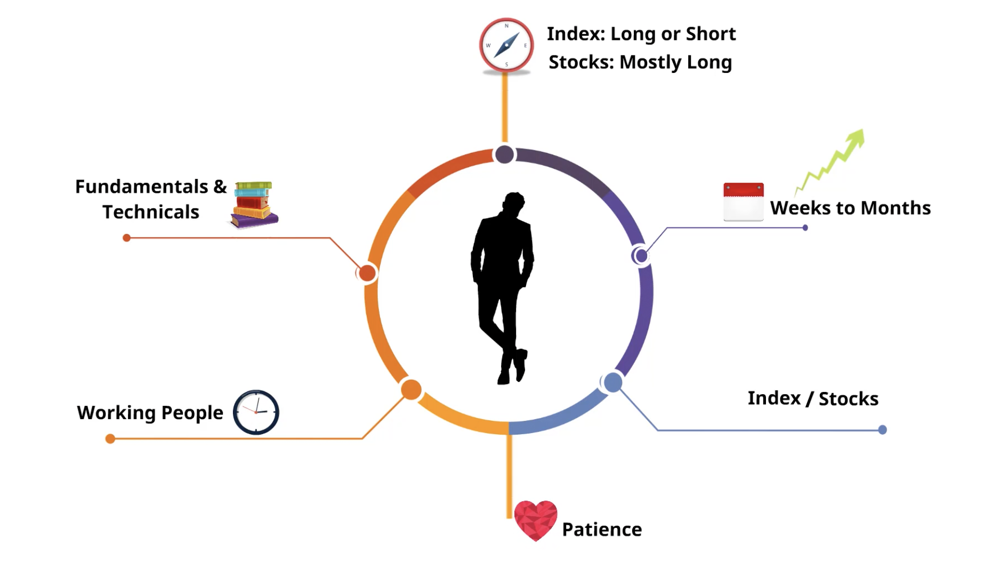

#### Swing trading

Holding period is few days to few weeks. Requires much more homework. Plenty of opportunities and stocks are available for swing. Option strategies learn well and it could make consistent source of income

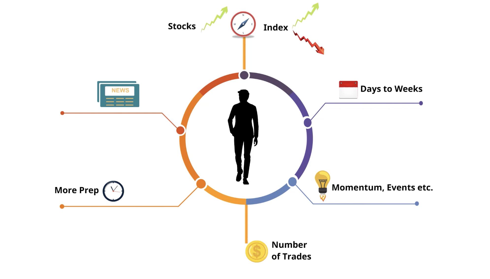

#### Intraday trading

Holding period is only one day. Buy morn sell eve. It requires special skills and hardest to master the skills. It requires lower capital. High risk, High Reward. Broker capital leverage is advantage. 

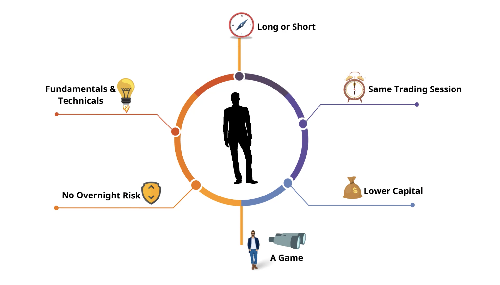

#### Scalping

A type of a day trader. He usually trades very large quantities of shares and holds the stock for very less time with an intention to make a small but quick profit. For example – He would buy 10,000 shares of TCS as 2212 at 9:15 and sell it 2212.1 at 9.16. He ends up making 1000/- profit in this trade. In a typical day, he would have placed many such trades. As you may have noticed a scalp trader is highly risk averse.

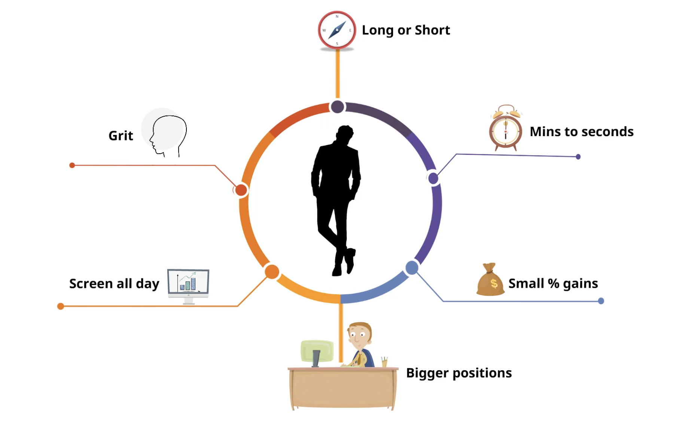

#### ALGO Trading

Algorithmic trading (also called automated trading, black-box trading, or algo-trading) uses a computer program that follows a defined set of instructions (an algorithm) to place a trade. The trade, in theory, can generate profits at a speed and frequency that is impossible for a human trader. 

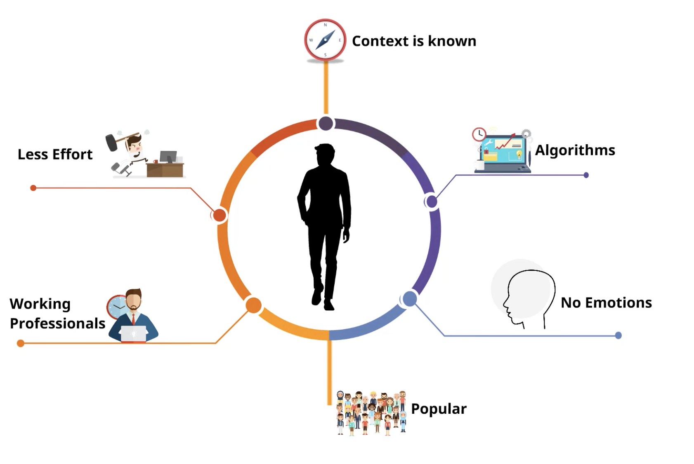

## Share

Investors who hold even 1 share is known to be part share owner of the company.   
**Advantages of being Share holder,**   
**Voting rights -** Can vote on resolutions that will decide future of the company. Crores of share out there. So our vote is not a big deal.  
**Dividends -** Sharing company's profit is dividend. 2 types Interim & final dividend. Interim dividend is paid before end of financial year due to surplus profit. Final dividend is paid after financial year. Dividend pay is not compulsory and it is upto the company.  
**Increase in Share value -** When the company grows the share price also increase. Hence can gain profit by holding to shares

## IPO

Read the IPO process above. Also read DRHP before applying for IPO.  
Retail investors, big institutions like mutual funds or pension companies, HNI - high net worth individuals all those will be interested in IPOs. When there is over subscription, as per SEBI regulations there are separate quotas for all these 3 is allocated.   
So it is not necessary that when you apply for an IPO, you will get full allotment.  
If you were lucky enough to get the shares, then it is credited to demand within couple of weeks before the company is listed in BSE,NSE

**Listing Gains -** The profit made by selling the shares that was bought in primary market and sold in secondary market on the listing day. On the day of Listing based on public's response sometimes the share can list higher or lower price than the IPO price

Once the company becomes public then as per SEBI rules, it has to regularly (probably once in Quarter) publish their financial statements such as Balance sheets, Cash Flow statements and P/L statements. Companies does not participate in secondary market.

## Stock Market Cycles

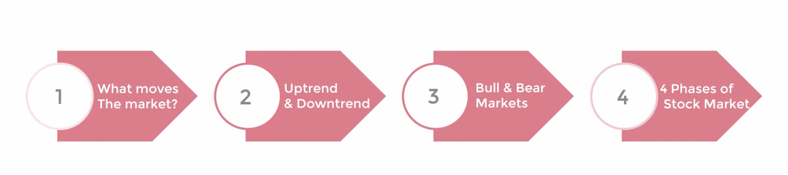

### What moves the Market

* Economy - Development of the country  
* Financial performance of Companies.  
* News & Events, Elections, RBI policies, wars, natural calamities.  
* Sentiments - What do people feel about the market

### Uptrend and Downtrend

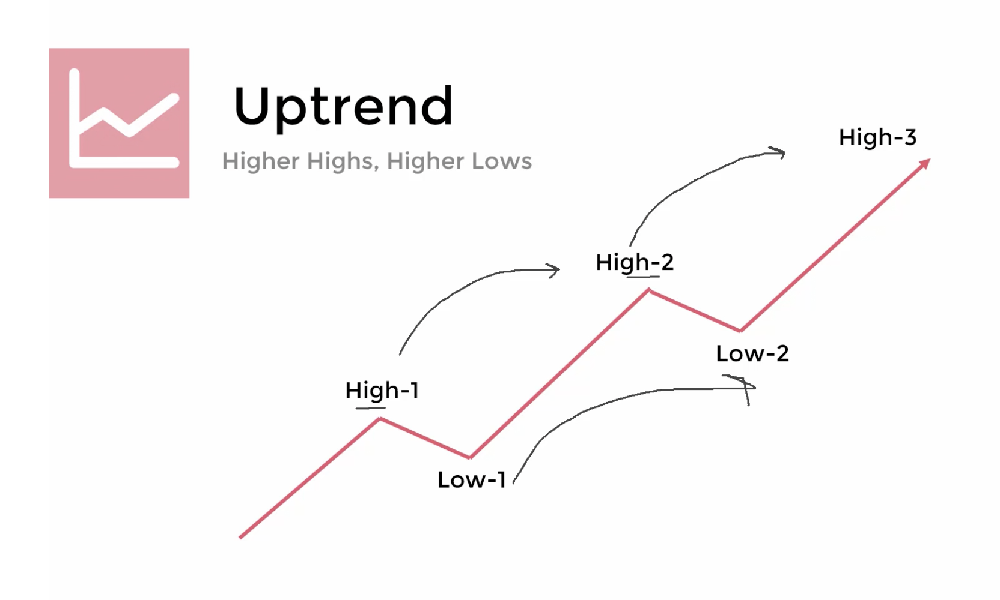

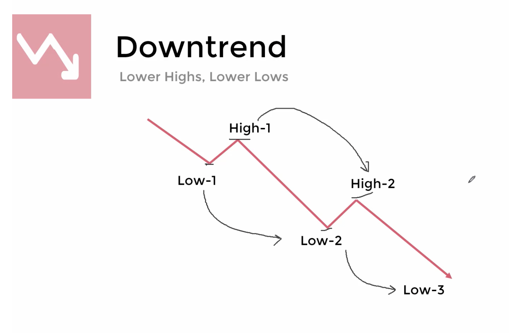

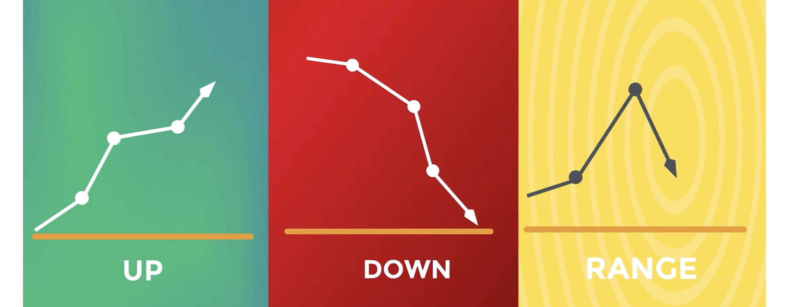

### Bull Market

* Primary trend is up
* Optimistic 
* Bad news is quickly forgotten
* Even the worst stock do well

### Bear Market

* Primary trend is down  
* Investors suffer but Traders unaffected, bcoz shorting is possible in Intraday  
* Sentiment is negative, even if the company performs well the stock price goes down.  
* Only the quality stocks perform well

### SECULAR Bull/Bear Market

* Very long term trend - it lasts for yrs like a decade, it can be a script or country.  For ex. US market from 2009-2019.  
* Investors make lot of money.  
* Mini contra-trends possible - For ex. a short downtrend is possible in a secular bull market.  
* Very important for investors - No impact for Traders. If you are part of secular Bear market then take your money out because you will not know when the trend is gonna end

**Secular Bull**

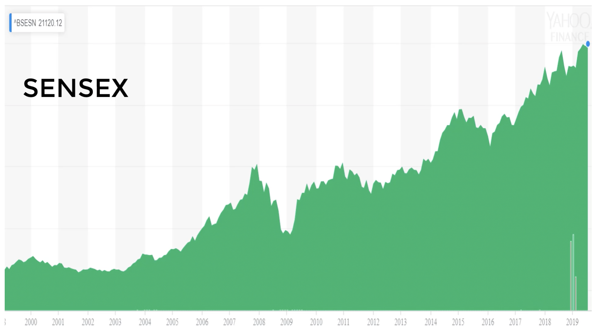

**Secular Bear**

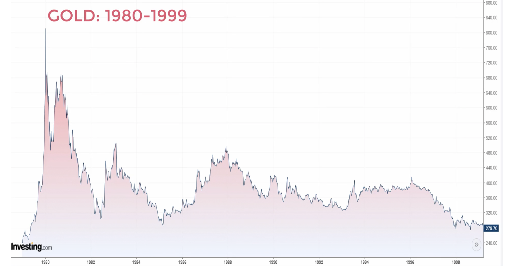

### 4 Phases of Stock Market

**1. Accumulation**  
**2. Markup**  
**3. Distribution**   
**4. Decline** 

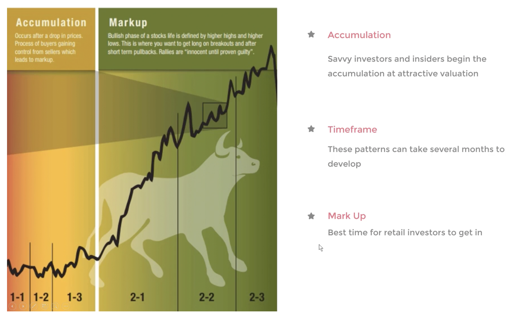
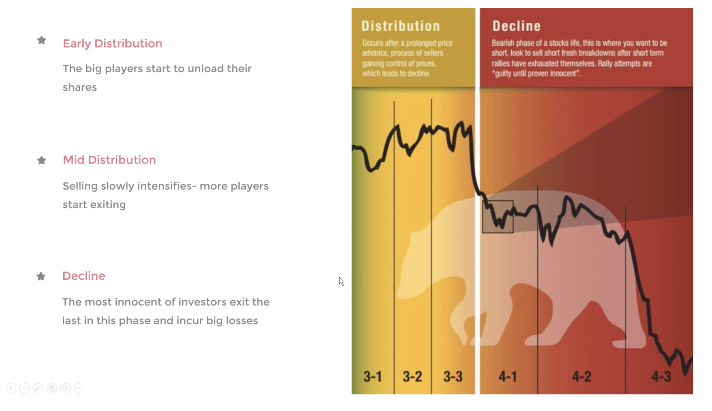

### BUBBLES

Trend which happens for short term like few weeks or few months or even lasts for few yrs. When a bubble bursts or crashes investors loss huge money. Investors who invested in quality stocks may tick around after sometime. But small investors who cannot with stand this crash will basically done for the market

**Characteristics**
 
* Public hysteria - everybody in the world, everyone around you will talk about it. people might fear of missing the chance  
* No relation with fundamentals - Valuation will be too high, nobody can explain why and how far the trend remains  
* Hyperbolic moves - Prices moves with huge differences, high higher highest. Nobody will pay that kind of value to an asset but still people will do so it means a bubble is formed 
* Sharp correction after bubble bursts - Result in massive correction, prices fall down extremely fast. Price comes to normal

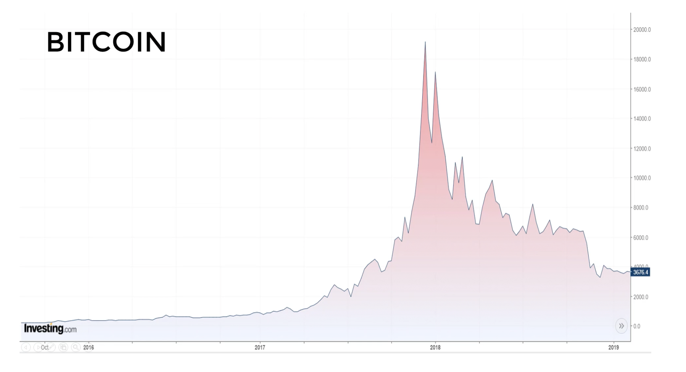

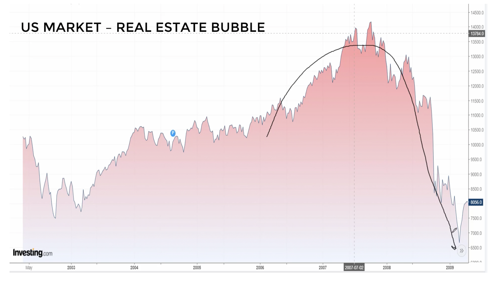

## Stock Market Timings

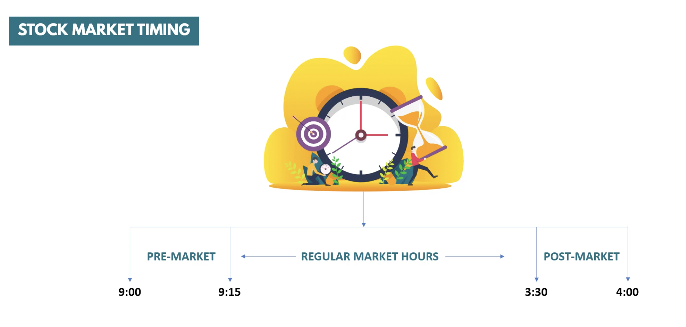

### Pre-Market session

Stock exchanges started the concept of pre-open session to minimize the volatility of securities during the market opening every day. Between **9:00 AM to 9:15 AM** is when the pre-market session is conducted. During the pre-market session for the first 8 minutes (between 9:00 AM and 9:08 AM) orders are collected, modified or cancelled. You can place limit orders/market orders. After 9.08 AM to 9.15 AM no new orders can be placed, orders placed are matched and trades confirmed. So technically you can place orders only for the first 8 minutes and only on equity segment.  

[NSE Pre-Market Equilibrium price determination](https://www.nseindia.com/products-services/equity-market-pre-open)

**Equilibrium price determination:** 
In a call auction price mechanism, equilibrium price is determined as shown below. Assume that NSE received bids for particular stock xyz at different prices in between 9:00 am and 9:15 am. Based on the principle of demand supply mechanism, exchange will arrive at the equilibrium price – the price at which the maximum number of shares can be bought / sold. In below example, the opening price will be 105 where maximum 27,500 shares can be traded. During order matching period order modification, order cancellation, trade modification and trade cancellation is not allowed.After completion of order matching there is a silent period to facilitate the transition from pre-open session to the normal market. All outstanding orders are moved to the normal market retaining the original time stamp.

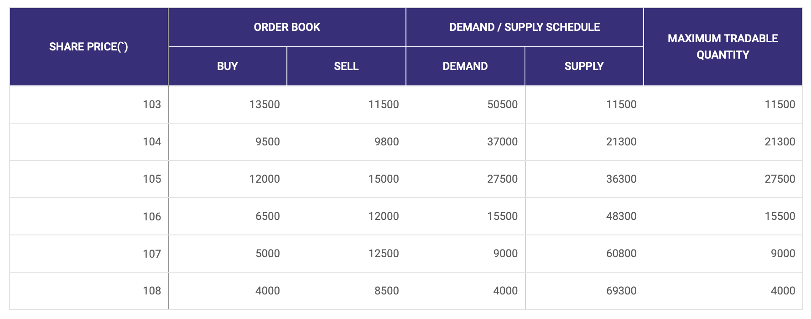
 
Regarding Execution of **AMO orders** : As soon as the market opens at 9.15am, all the AMO orders are sent by the broker end to Exchange.

- Low Liquidity - Even if order is placed between 9 - 9.08am but the probablity of execution of trade is less. unless it is very active stock like reliance.  
- Pre-emptive - A Intraday trader has to react to the market. pre-emptive is arrogant and buying shares without giving opportunity to others. **Do not trade b/w 9am to 9.30am.** High volatile.  
- Misleading - Info from pre market may be wrong. Do not trust pre-market. Closing existing delivery position is ok fine but don't take new trades

### Regular Market session

- mid day is dull 10.30am to 1.30pm
- after 3'o clock do not take any trades
- best time to take trades are 9.30am to 10.30am and 1.30pm to 3.00pm.  
- MIS auto square-off time is 3.15pm

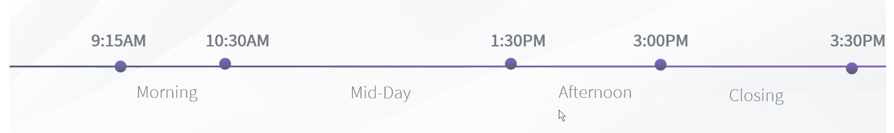

### Post-Market session

- calculate closing price for scripts and indices b/w 3.30pm to 3.40pm. Book keeping time for stock exchanges. 
- B/w 3.40pm to 4.00pm is post market session. One can place orders but it can be only delivery orders. IMPORTANT! the orders plcaed during post market session whether it is limit or market order BUT the order automatically will get execute at closing price. So risky! Be careful!  
- Low liquidity, not for traders but for investors

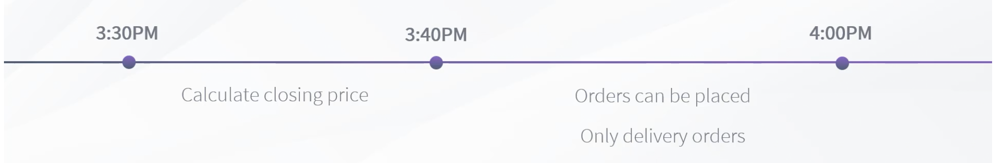

### Holidays


### FAQs


### Advice


## Major Players in Stock Market


- **DII - Domestic Institutional investors.** Indian institutions that pool money from public and invest on their behalf. Managed by **fund manager**


- **FII - Foreign Institutional investors.** FIIs are companies outside of India who invests money in indian stock market. they are almost like DIIs who pools money from people of other countries and invest in developing countries like India. FIIs are somewhat notorious because they can invest any where in the globe, so whenever they see an opportunity in other countries they pull money from indian stock market and invest there. So our Indian market may become volatile because of this. So strict guidelines is imposed by SEBI

## BSE vs NSE


## Liquidity

Ease of finding buyers & sellers in a market is called liquidity. Cash market has highest liquidity, followed by Gold & Equity. Higher liquidity ensures ease of buying & selling, better prices for entry & exit.

**Liquid stock** - More people trade on it  
**Illiquid stock** - Less people trade on it

Higher the market cap of a company, higher the liquidity on that stock 

High cap stocks - Reliance, TCS, HDFC, Maruti suzuki  
Mid cap stocks - Mindtree, apollo hospitals, Indian bank   
Small cap stocks - South Indian bank, Jagran  
Micro cap stocks - very small cap companies

Always stay with high or mid cap stocks. Small cap stocks are dangerous and could drop prices drastically

**Liquidity is also calculated using spreads.** Hgher liquidity has less spread


**Liquidity can be also found using Intraday charts.**  


**Liquidity in Instruments**

In Futures large cap stocks like Reliance, HDFC has high liquidity. whereas small midcap stocks has lower liquidity  
In Options high liquidity belongs to NIFTY, Bank NIFTY. But for individual stocks the liquidity is very low. So stay way from individual stocks in options 

## BANK NIFTY

It is **Sectoral Index**. Comprises of top 12 performing banks listed in NSE.
We have NIFTY metals, IT, Pharma. Eventhough all these indices exists they are not traded only Bank nifty is traded and hence important. Because Banks are the foundation for the economy.  
HDFC bank has higher weightage in bank nifty i.e. 32%. So bank nifty movement is based on HDFC stock movement.  
Most of the time Bank Nifty moves Nifty and sometimes Nifty also can move Bank nifty.   
Nifty and Bank nifty should be tracked parallel

Bank Nifty can be traded only in Futures & Options

**Benefits to traders:**

* High liquidity  
* Variety in Options market  
* Easier to trade - Easy to trade than Nifty because nifty consists of stocks from various sector and if 1 or 2 sectors doesn't perform then it affects nifty. But bank nifty consists of only 12 companies of same sector hence easy

**Benefits to Investors:**

* Benchmarking  
* Index funds  - can invest in index funds through mutual funds hence could take advantage of the market  
* Structured products - some financial instrument based on index like bank nifty 

## Trading Jargons


## Index Trading

NIFTY and BANK NIFTY are the only indices that can be traded. It is called Derivative segment.  
Easier entry & exit.  
Volatility is low


## Risk-Reward

- Possibility of loss
- Magnitude of loss
- Positve risk (losing profits) and Negative risk (losing capital)

**Risk**

1. Risk can be measured sometimes and cannot sometimes. Risk has to ve defined before taking any trade.  
1. Risk various by Instruments. F&O has higher risk than cash segment.  
1. Risk various by stocks also. Adjust risk by position size.  
1. Risk various by Market. Trend days ( bullish or bearish days) is less risky than volatile days. Volatile days are high risk.  
1. Risk is inevitable.  
1. How to access risk - look at past behaviour 

**Reward**

1. Reward is less important than risk   
1. A trader must worry about risk than reward.  

**Decisions to make for Trader**

1. Whether or not to take a trade.  
1. Determine the position size, Higher the risk lower the position size.  
1. Entry point. Do not chase the Rally. Wait for your entry.  
1. Determine when to trail stoploss
1. When to book partial profits
1. When to exit. When you are in doubt don't take trade.


## Top Books for Traders

### 1. Trading in the zone
### 2. Market Wizards
### 3. Trading for a living


## SGX NIFTY

* SGX NIFTY is a Nifty futures contract that is traded on Singapore exchange.  
* Outside India people (NRIs) cannot trade derivatives of other countries except the country in which they live in due to strict International laws. So SGX NIFTY is an alternative for them to trade   
* FIIs invested in India create hedging positions in SGX NIFTY. 
* Indian residants cant trade SGX NIFTY.   
* Singapore Stock exchanges open for all day long   
* Tracking of SGX NIFTY is little bit needed for future view of our NIFTY 50  


## Shorting

* Sell first, Buy later.  
* Shorting is done when you predeict the stock price is gonna fall down.  
* Shorting can be done in all 3 instruments cash, futures and options.  
* Shorting position in cah sagment should be square-off in same trading session (Intraday) orelse high penalities (**short delivery**).  
* Not all scripts can be shorted but it is decided by the broker. Broker maintains list on which stock intraday can be done    
* In Futures & options shorting is allowed for delivery also. NSE maintains list on which can be done (Bhavcopy.csv file). Based on diff parameters like volume, market cap nse decides it.   
* Few stocks might be in ban by NSE for trading in F&O segment.  
* In shorting if you take delivery there is overnight risk. Risk is more in F&O stocks than F&O Index.  
* Overnight shorts must be hedged. Can be done by Buying a call option or selling put option. Never take short position without hedging. 


### Dangers of Shorting

- Potential of unlimited loss (bcoz stock can go up to any price)   
- Risk of Short delivery (penalty for not buying back the shares)   
- Risk of Short squeeze (promotors can send positive news overnight stock goes up)

**Short covering**

Buying back of shares to exit from short position is called short covering. 


Rally that is due to short sellers in called **Short covering rally**. When there is good news about company then stock price goes up little, short positioned traders get fear and buy back shares to exit, this moves stock price even higher so now other sellers also buy back so even further stock goes up.


## Cost of Trading

Very important to understand and calculate charges and cost of every trade only then profits can be made


### Advice

- Don't pay high brokerage.  
- Spend time with Brokerage calculator.  
- Check your Ledger regularly. 
- Treat trading as a business.  
- Take as few trades as possible

## Broker Selection Strategy

Very important for making profits from a trader's perspective

- Low Brokerage.  
- Need Research reports given by full service brokers like sharekhan, HDFC securities, ICICI direct. 
- So have 2 Discount brokers and 1 Full service broker


## Trade Log

Keeping track of trades taken by us is called Trade Log. We can log trades and generate report which will give us good insight of how we are peforming. It brings descipline. Log using ZOHO Analytics


## KPI - Key Performance Indicators

**Measure your trading performance**


### Success Rate

Nifty success rate = > 3 points.  
Stock success rate = > 0.2% 


### Profit Rate

More important, profit rate gives you how profitable you are.  
Even if you have less success rate, if you have high profit rate then still you are on profits.
Total profits of all trades divide by total loss in all trades


### Average Trades/Day

Number of trades to take in a day. It is essential because more number of trades means high stress, high brokerage, gross profit or loss doesn't matter if you overtrade and it is meaningless


### Average Duration/Trade

How long you are staying in the trade. Whether are you in profit or loss for what duration of the trade. Is duration is okay or causing more pressure?


### Return on Traded Capital

Measure your performance. Always use gross profit divided by total traded value. If the vaule is above 0.2% then its good.


### Longs vs Shorts

How many trades were taken on long side with an expectation that price will get higher and how many trades were taken on short side with an expectation that the prices will go down.


